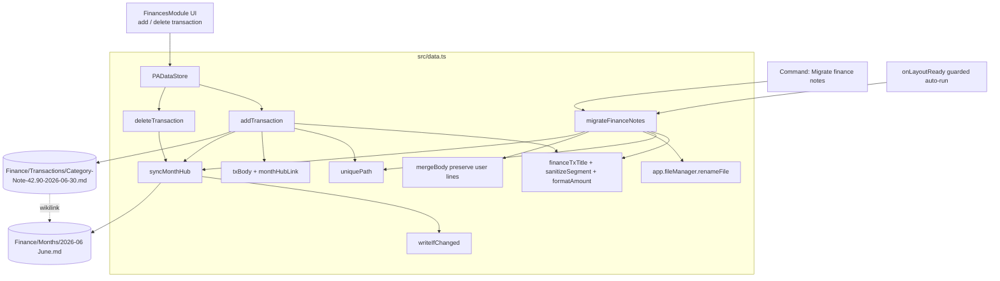
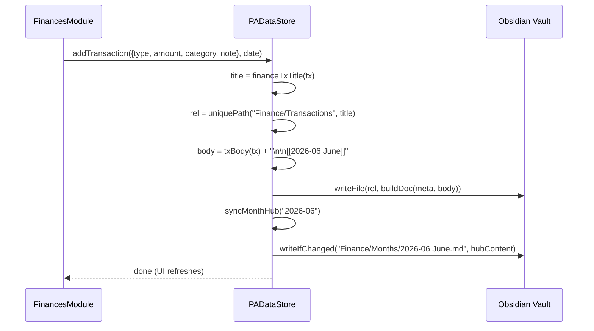
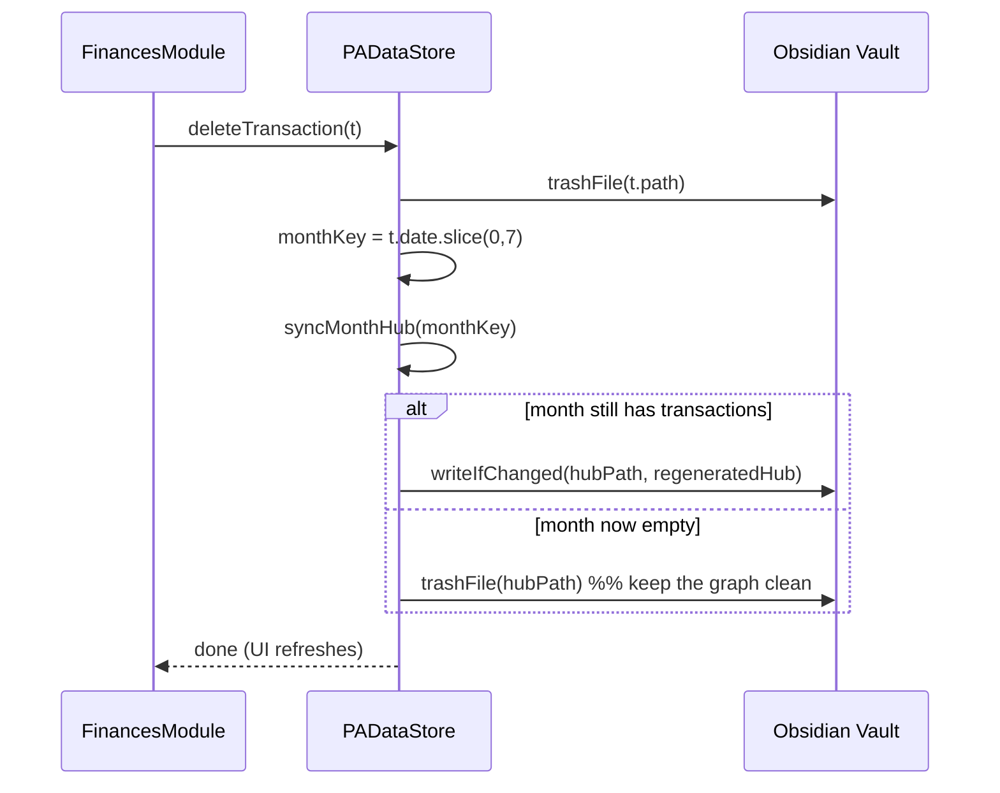
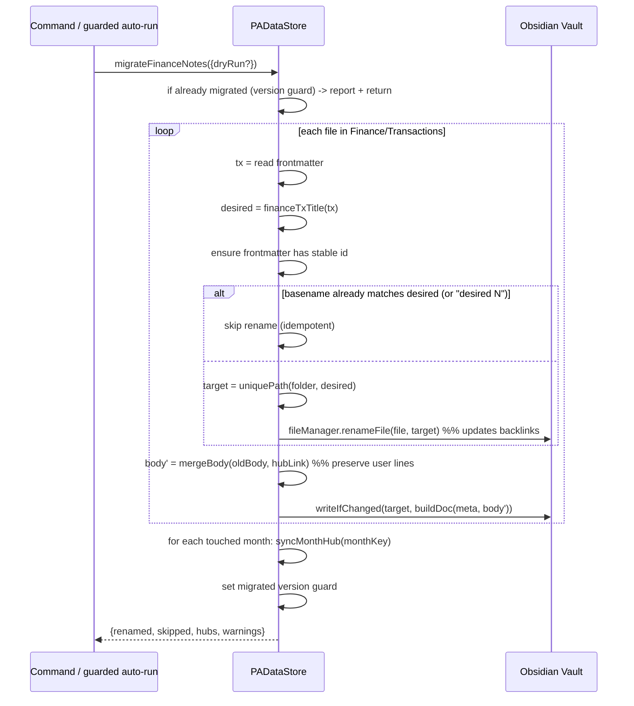

# Design Document: Finance Readable Notes

## Overview

Today the Finance module writes one Markdown file per transaction to `Finance/Transactions/<date>-<tx_type>-<time>-<rand>.md` (e.g. `2026-06-30-expense-142530-a3f9k.md`). The name is machine-generated and opaque, so the Obsidian file list and Graph View are unreadable, and there is no structure connecting a month's transactions.

This feature makes those per-transaction notes human-readable and organizes them in the Graph View using **monthly hub notes**. We keep one file per transaction (no table consolidation), rename each file to a readable scheme `<category>-<note>-<amount>-<YYYY-MM-DD>`, link every transaction note to its month's hub via a `[[2026-06 June]]` wikilink, and generate a consolidated monthly hub note (income/expense/balance summary + links to that month's transactions). A **retroactive migration** brings existing vaults onto the new scheme safely: it preserves any user-added lines in note bodies, is idempotent, and is guarded so it never runs needlessly.

The design touches only the data layer (`src/data.ts`) and reuses existing primitives already present in that file — `buildDoc`, `uniquePath`, `safeName`, `writeFile`/`writeIfChanged`, `frontmatter`, `fileAt`, `loadConfig().currency`. It does **not** depend on the personal `local` branch's kiro-cli bridge, so it works in both the community and personal builds. Scope is Finance transactions only; meal logs and workouts can reuse the same pattern later (see Future Work).

---

## Architecture



Key idea: **frontmatter is the source of truth** for transaction data. Filenames and hub notes are *derived, regenerable views*. Because loading reads only frontmatter (verified below), renaming files and regenerating hubs never changes the loaded data — it only changes presentation in the vault and Graph View.

---

## Sequence Diagrams

### Create a transaction



### Delete a transaction (including the last one of a month)



### Migration



---

## Components and Interfaces

### Component: Filename builder (pure functions)

**Purpose**: Turn a transaction into a readable, filesystem-safe title deterministically.

```typescript
/** Characters that are illegal in Obsidian/OS filenames (mirrors safeName's set). */
const INVALID_FILENAME_CHARS = /[\\/:*?"<>|#^[\]]/g;

/**
 * Sanitize one path segment (category or note) for use in a filename.
 * - Replaces invalid filename characters with a space (so they become separators).
 * - Collapses whitespace runs and converts them to single hyphens.
 * - Collapses repeated hyphens and trims leading/trailing hyphens.
 * - Preserves Unicode letters (including accents like á, ã, ç) and digits — readable.
 * Deterministic and side-effect free.
 */
export function sanitizeSegment(raw: string): string;

/** Format money for a filename: point decimal separator, exactly 2 decimals, no grouping. */
export function formatAmount(n: number): string; // 42.9 -> "42.90", 1234567.5 -> "1234567.50"

/**
 * Build the readable transaction title (no extension, no collision suffix):
 *   <category>-<note>-<amount>-<YYYY-MM-DD>
 * The note segment is omitted when empty/blank. Segments that sanitize to empty are dropped.
 * Never includes an income/expense marker (category conveys it).
 */
export function financeTxTitle(tx: {
  category: string; note?: string; amount: number; date: string;
}): string;
```

**Responsibilities**:
- Produce identical output for identical input (determinism).
- Never emit invalid filename characters or spaces.
- Gracefully omit the note segment when empty.
- Leave collision handling to `uniquePath` (clean names by default).

### Component: Monthly hub

**Purpose**: Maintain one consolidated, regenerable note per month.

```typescript
/** "2026-06" from a YYYY-MM-DD date. */
function monthKeyOf(date: string): string;             // "2026-06-30" -> "2026-06"
/** Hub basename: "2026-06 June" (sortable prefix + English month name). */
function monthHubTitle(monthKey: string): string;      // "2026-06" -> "2026-06 June"
/** Logical vault path for a month hub. */
function monthHubPath(monthKey: string): string;       // "Finance/Months/2026-06 June.md"

/**
 * Regenerate (or delete) the hub note for a month based on current transactions.
 * - Reads all transactions in the month from frontmatter.
 * - Writes a readable summary + links via writeIfChanged (no-op when unchanged).
 * - If the month has zero transactions, trashes the hub file (keeps the graph clean).
 */
async syncMonthHub(monthKey: string): Promise<void>;
```

**Responsibilities**:
- Deterministic content given the set of transactions in the month.
- Idempotent writes (`writeIfChanged`) to avoid sync loops / churn.
- Self-cleaning: an empty month has no hub.

### Component: Migration

**Purpose**: Bring an existing vault onto the new scheme safely and idempotently.

```typescript
interface MigrationReport {
  renamed: number;      // files renamed to the new scheme
  skipped: number;      // already-correct files (idempotent no-ops)
  hubsWritten: number;  // month hubs created/updated
  hubsRemoved: number;  // empty-month hubs trashed
  warnings: string[];   // collisions, missing ids, unusual bodies
}

/**
 * Rename all Finance/Transactions files to the readable scheme, ensure each body
 * links its month hub while PRESERVING user-added lines, and (re)generate all
 * month hubs. Idempotent and guarded. `dryRun` computes the report without writing.
 */
async migrateFinanceNotes(opts?: { dryRun?: boolean }): Promise<MigrationReport>;
```

---

## Data Models

### Transaction note file

Path: `Finance/Transactions/<title>.md` where `<title> = financeTxTitle(tx)` plus an optional ` 2`, ` 3`… collision suffix from `uniquePath`.

Frontmatter (unchanged — remains the source of truth):

```yaml
---
id: 1719772530000        # stable identity (Number or UUID string); never derived from filename
type: "transaction"
tx_type: "expense"       # "income" | "expense" — conveys sign
date: "2026-06-30"       # YYYY-MM-DD
amount: 42.9             # Number
category: "Leisure"
note: "ebanx*spotify"
logged: "2026-06-30T14:25:30.000Z"
---
```

Body (new format, hub link appended; user lines preserved):

```markdown
# Leisure -42.90

ebanx*spotify

[[2026-06 June]]
```

**Validation / rules**:
- `date` MUST be `YYYY-MM-DD`; `monthKeyOf` uses the first 7 chars.
- `amount` is a non-negative Number in frontmatter; the sign shown in the body/UI comes from `tx_type`.
- `id` MUST be present after migration so identity never depends on the filename.

### Month hub file

Path: `Finance/Months/<YYYY-MM Month>.md` (basename unique across the vault so `[[2026-06 June]]` resolves without a path).

```yaml
---
type: "finance-month-hub"
month: "2026-06"
generated: "2026-07-01T09:00:00.000Z"
---
```

Body (regenerated deterministically):

```markdown
# June 2026

**Income:** $3,000.00
**Expenses:** $1,242.90
**Balance:** $1,757.10

## Transactions

- [[Salary-Monthly salary-3000.00-2026-06-05]] — +$3,000.00
- [[Housing-Rent-1200.00-2026-06-05]] — -$1,200.00
- [[Leisure-ebanx-spotify-42.90-2026-06-30]] — -$42.90
```

**Rules**:
- Transactions listed sorted by `date` then title (stable, deterministic order).
- Money formatted with the configured `currency` from `loadConfig()` (same `fmt` style already used in the UI: grouping + 2 decimals).
- `Balance = Income − Expenses`.

---

## Algorithmic Pseudocode

> All examples in TypeScript (the codebase language). Formal specifications given as preconditions/postconditions/invariants.

### sanitizeSegment

```typescript
export function sanitizeSegment(raw: string): string {
  return (raw ?? "")
    .replace(INVALID_FILENAME_CHARS, " ") // *, /, :, etc. become separators
    .replace(/\s+/g, "-")                 // whitespace runs -> single hyphen
    .replace(/-+/g, "-")                  // collapse repeated hyphens
    .replace(/^-+|-+$/g, "")              // trim leading/trailing hyphens
    .trim();
}
```

**Preconditions:** `raw` is any string (or nullish, treated as `""`).
**Postconditions:**
- Result contains no character in `INVALID_FILENAME_CHARS`.
- Result contains no ASCII whitespace and no leading/trailing/duplicate hyphens.
- Unicode letters (incl. accents) and digits are preserved.
- Pure and deterministic: same input ⇒ same output.

**Worked examples:**
| Input | Output |
|-------|--------|
| `ebanx*spotify` | `ebanx-spotify` |
| `Ar condicionado` | `Ar-condicionado` |
| `Café / Padaria` | `Café-Padaria` |
| `  spaced  out  ` | `spaced-out` |
| `***` | `` (empty → segment dropped) |

### formatAmount

```typescript
export function formatAmount(n: number): string {
  const safe = Number.isFinite(n) ? Math.abs(n) : 0; // no sign in filename; guard NaN/Infinity
  return safe.toFixed(2); // toFixed always uses "." and 2 decimals, no grouping
}
```

**Preconditions:** `n` is a number (may be negative, 0, large, NaN/Infinity).
**Postconditions:** matches `/^\d+\.\d{2}$/`; `42.9 → "42.90"`, `0 → "0.00"`, `1234567.5 → "1234567.50"`, `NaN → "0.00"`.

### financeTxTitle

```typescript
export function financeTxTitle(tx: { category: string; note?: string; amount: number; date: string; }): string {
  const category = sanitizeSegment(tx.category) || "Other";
  const note = sanitizeSegment(tx.note ?? "");
  const amount = formatAmount(tx.amount);
  const date = tx.date.slice(0, 10);
  const segments = note ? [category, note, amount, date] : [category, amount, date];
  return segments.join("-");
}
```

**Preconditions:** `tx.date` is `YYYY-MM-DD`; `tx.amount` is a number.
**Postconditions:**
- No income/expense marker present.
- Note segment present ⟺ `sanitizeSegment(note)` is non-empty.
- Output is a valid filename base (no invalid chars, no spaces).
- Deterministic.

**Worked examples:**
| category | note | amount | date | title |
|----------|------|--------|------|-------|
| `Leisure` | `ebanx*spotify` | `42.9` | `2026-06-30` | `Leisure-ebanx-spotify-42.90-2026-06-30` |
| `Ar condicionado` | `` | `1200` | `2026-06-05` | `Ar-condicionado-1200.00-2026-06-05` |
| `Salary` | `Monthly salary` | `3000` | `2026-06-05` | `Salary-Monthly-salary-3000.00-2026-06-05` |
| `Other` | `***` | `9.5` | `2026-07-01` | `Other-9.50-2026-07-01` (symbol-only note dropped) |

### Collision handling (reuse `uniquePath`)

```typescript
// Existing helper — clean base name, only appends " 2", " 3", ... on a REAL collision.
private uniquePath(folder: string, title: string): string {
  const base = safeName(title);
  let rel = `${folder}/${base}.md`;
  let n = 2;
  while (this.fileAt(rel)) { rel = `${folder}/${base} ${n}.md`; n++; }
  return rel;
}
```

We do **not** use the current random suffix. Two transactions that produce the same title (same category, note, amount, and date) get `… 2`, `… 3`, etc. — clean and only when needed.

**Loop invariant:** at the top of each iteration, every path `${folder}/${base} k.md` for the already-checked `k < n` was found to exist. **Postcondition:** the returned path does not currently exist (collision-free at build time).

### addTransaction (revised)

```typescript
async addTransaction(t: { type: string; amount: number; category: string; note?: string }, date = todayLocal()): Promise<void> {
  const tx_type = t.type === "income" ? "income" : "expense";
  const meta: FM = {
    id: Date.now(), type: "transaction", tx_type, date,
    amount: t.amount, category: t.category || "Other", note: t.note || "",
    logged: new Date().toISOString(),
  };
  const monthKey = monthKeyOf(date);
  const sign = tx_type === "income" ? "+" : "-";
  const body = `# ${t.category} ${sign}${formatAmount(t.amount)}\n\n${t.note || ""}\n\n[[${monthHubTitle(monthKey)}]]\n`;
  const title = financeTxTitle({ category: t.category || "Other", note: t.note, amount: t.amount, date });
  const rel = this.uniquePath("Finance/Transactions", title);
  await this.writeFile(rel, this.buildDoc(meta, body));
  await this.syncMonthHub(monthKey);
}
```

### syncMonthHub

```typescript
async syncMonthHub(monthKey: string): Promise<void> {
  const cur = (await this.loadConfig()).currency || "$";
  const txs = this.loadTransactions()
    .filter((t) => t.date.startsWith(monthKey))
    .sort((a, b) => a.date.localeCompare(b.date)
      || financeTxTitle(a).localeCompare(financeTxTitle(b)));

  const rel = `Finance/Months/${monthHubTitle(monthKey)}.md`;

  if (!txs.length) {                    // empty month -> remove hub (clean graph)
    const existing = this.fileAt(rel);
    if (existing) await this.removeFile(existing);
    return;
  }

  const income = txs.filter((t) => t.type === "income").reduce((s, t) => s + t.amount, 0);
  const expense = txs.filter((t) => t.type === "expense").reduce((s, t) => s + t.amount, 0);
  const money = (n: number) => `${cur}${(Math.round(n * 100) / 100)
    .toLocaleString(undefined, { minimumFractionDigits: 2, maximumFractionDigits: 2 })}`;

  const [y, m] = monthKey.split("-").map(Number);
  const monthName = new Date(y, m - 1, 1).toLocaleString("default", { month: "long" });

  let body = `# ${monthName} ${y}\n\n`;
  body += `**Income:** ${money(income)}\n**Expenses:** ${money(expense)}\n**Balance:** ${money(income - expense)}\n\n`;
  body += `## Transactions\n\n`;
  for (const t of txs) {
    const link = financeTxTitle(t);
    const sign = t.type === "income" ? "+" : "-";
    body += `- [[${link}]] — ${sign}${money(t.amount)}\n`;
  }

  const meta: FM = { type: "finance-month-hub", month: monthKey, generated: new Date().toISOString() };
  await this.writeIfChanged(rel, this.buildDoc(meta, body));
}
```

**Note on `generated` and `writeIfChanged`:** because `generated` changes every call, comparing the whole document would always differ and defeat `writeIfChanged`. The implementation MUST compare only the *body* (or omit the timestamp) when deciding whether to rewrite, so an unchanged month is a true no-op. This is a correctness requirement, captured as a property below.

### deleteTransaction (revised)

```typescript
async deleteTransaction(t: Transaction): Promise<void> {
  const f = this.app.vault.getAbstractFileByPath(t.path);
  if (f instanceof TFile) await this.removeFile(f);
  await this.syncMonthHub(monthKeyOf(t.date)); // may delete the hub if that was the last one
}
```

### migrateFinanceNotes (idempotent, body-preserving, guarded)

```typescript
async migrateFinanceNotes(opts: { dryRun?: boolean } = {}): Promise<MigrationReport> {
  const report: MigrationReport = { renamed: 0, skipped: 0, hubsWritten: 0, hubsRemoved: 0, warnings: [] };
  const folder = "Finance/Transactions";
  const files = this.listMarkdown(folder);
  const touchedMonths = new Set<string>();

  for (const file of files) {
    const m = this.frontmatter(file);
    const tx = {
      category: str(m.category) || "Other",
      note: str(m.note),
      amount: num(m.amount),
      date: str(m.date).slice(0, 10),
      tx_type: str(m.tx_type) || "expense",
    };
    if (!tx.date) { report.warnings.push(`Skipped (no date): ${file.path}`); continue; }
    touchedMonths.add(monthKeyOf(tx.date));

    const desiredBase = financeTxTitle(tx);

    // Idempotency: current name already matches desired base or "desired base N"
    const alreadyNamed = file.basename === desiredBase
      || new RegExp(`^${escapeRegExp(desiredBase)} \\d+$`).test(file.basename);

    // 1) Ensure a stable id so identity never depends on the filename.
    if (m.id == null && !opts.dryRun) {
      await this.patchFrontmatter(file, (fm) => { fm.id = Date.now(); });
    }

    // 2) Rename to the readable scheme (skip if already correct).
    let targetFile: TFile = file;
    if (!alreadyNamed) {
      const targetRel = this.uniquePath(folder, desiredBase);
      if (!opts.dryRun) {
        await this.app.fileManager.renameFile(file, this.full(targetRel)); // updates backlinks
        targetFile = this.fileAt(targetRel.replace(/^.*?Finance/, "Finance")) ?? file;
      }
      report.renamed++;
    } else {
      report.skipped++;
    }

    // 3) Ensure the body links the month hub, PRESERVING user-added lines.
    const monthKey = monthKeyOf(tx.date);
    const hubLink = `[[${monthHubTitle(monthKey)}]]`;
    if (!opts.dryRun) {
      const raw = await this.app.vault.read(targetFile);
      const { frontmatter: fmText, body } = splitFrontmatter(raw);
      const merged = mergeBody(body, hubLink, tx);   // see below
      if (merged !== body) await this.writeFile(relOf(targetFile), `${fmText}\n${merged}`);
    }
  }

  // 4) (Re)generate every touched month hub.
  for (const key of touchedMonths) {
    if (!opts.dryRun) await this.syncMonthHub(key);
  }

  return report;
}

/**
 * Preserve everything the user wrote; only ensure the hub wikilink exists exactly once
 * and (optionally) refresh the leading "# heading". Never removes unknown lines such as
 * a manual `Hub: [[Hub - Personal]]`.
 */
function mergeBody(body: string, hubLink: string, tx: {...}): string {
  const lines = body.split("\n");
  const hasHub = lines.some((l) => l.trim() === hubLink);       // idempotent: don't double-add
  const kept = lines;                                            // keep ALL user lines as-is
  if (!hasHub) { if (kept.length && kept[kept.length - 1].trim() !== "") kept.push(""); kept.push(hubLink); }
  return kept.join("\n");
}
```

**Preconditions:** transaction files live under `Finance/Transactions`; frontmatter holds `date`, `amount`, `category`, `note`, `tx_type`.
**Postconditions:**
- Every processed file is named per the scheme (or a clean ` N` variant on collision).
- Every processed body contains the month hub wikilink exactly once.
- All user-added body lines are retained (nothing but a missing hub link is added).
- Every touched month has an up-to-date hub; empty months have none.
- Running again performs no renames and no body rewrites (idempotent).

**Loop invariant:** after processing file *i*, files `0..i` are all correctly named, carry the hub link exactly once, and retain their original user lines.

### Trigger mechanism & guard

Two triggers, with the guard preventing repeat work:

```typescript
// Plugin data flag (persisted via saveData), version-stamped so future schema bumps can re-run.
interface PASettings { /* ...existing... */ financeNotesSchema?: number; }
const FINANCE_NOTES_SCHEMA = 1;

// (A) Explicit command — always available, safe to re-run.
this.addCommand({
  id: "migrate-finance-notes",
  name: "Finance: migrate transaction notes to readable names",
  callback: async () => {
    const report = await this.store.migrateFinanceNotes();
    this.settings.financeNotesSchema = FINANCE_NOTES_SCHEMA;
    await this.saveSettings();
    new Notice(`Finance notes migrated: ${report.renamed} renamed, ${report.skipped} already OK, ${report.hubsWritten} hubs.`);
  },
});

// (B) One-time guarded auto-run on layout ready (best-effort, non-blocking).
this.app.workspace.onLayoutReady(() => {
  if ((this.settings.financeNotesSchema ?? 0) < FINANCE_NOTES_SCHEMA) {
    void (async () => {
      try {
        await this.store.migrateFinanceNotes();
        this.settings.financeNotesSchema = FINANCE_NOTES_SCHEMA;
        await this.saveSettings();
      } catch (e) { /* leave guard unset so the explicit command can retry */ }
    })();
  }
});
```

**Recommendation:** ship **both**, but make the explicit command the primary, documented path and treat the auto-run as a convenience. Rationale:
- The command lets the user **back up first** and run migration intentionally (bulk rename is the riskiest operation here).
- The auto-run covers users who never read release notes, but is guarded (`financeNotesSchema`) so it runs at most once per schema version, and the guard is only set **after** success, so a failure can be retried via the command.
- Because migration is idempotent, running the command after the auto-run is harmless.

---

## Verification: loading does not depend on filenames

`loadTransactions` builds each `Transaction` **entirely from frontmatter**:

```typescript
loadTransactions(): Transaction[] {
  return this.listMarkdown("Finance/Transactions").map((f) => {
    const m = this.frontmatter(f);
    return {
      id: str(m.id) || f.basename,          // <-- ONLY filename dependency (fallback)
      date: str(m.date).substring(0, 10),   // frontmatter
      type: str(m.tx_type) || "expense",    // frontmatter
      amount: num(m.amount),                // frontmatter
      category: str(m.category) || "Other", // frontmatter
      note: str(m.note),                    // frontmatter
      path: f.path,                          // current path, not parsed for data
    };
  }).filter((t) => t.date);
}
```

Findings:
- `date`, `type`, `amount`, `category`, `note` come from frontmatter → **rename-invariant**.
- `path` is set to the current file path but is **never parsed** to derive data; it is used only for delete (`getAbstractFileByPath`) and as a tiebreak in the ledger sort. After a rename, `loadTransactions` returns the up-to-date path, so delete still works.
- The **only** filename dependency is the `id` fallback `|| f.basename`, used when frontmatter has no `id`. Existing transactions written by `addTransaction` always set `id: Date.now()`, so the fallback does not fire for them. To be safe, migration **ensures every file has a frontmatter `id`** before renaming (step 1 above), guaranteeing identity is stable across the rename.
- The ledger sort in `FinancesModule.renderLedger` uses `b.path.localeCompare(a.path)` as a tiebreak within the same date; after migration this tiebreak orders by the new readable name instead of the old timestamp. This is cosmetic only (same-date ordering) and does not affect totals or data.

**Conclusion:** renaming is safe. The one caveat (`id` fallback) is neutralized by ensuring `id` exists during migration. This is captured as a correctness property.

---

## Error Handling

### Filesystem rename collision
**Condition:** two transactions produce the same title, or a target name already exists.
**Response:** `uniquePath` appends ` 2`, ` 3`, … before renaming; migration records nothing abnormal (clean names preserved).
**Recovery:** none needed; deterministic and collision-free at build time.

### Rename failure mid-migration
**Condition:** `fileManager.renameFile` throws (locked file, sync conflict, permission).
**Response:** catch per-file, push a warning to the report, continue with remaining files; do **not** set the schema guard on a failed auto-run.
**Recovery:** migration is idempotent — re-running the command retries only the files still on the old scheme.

### Missing / malformed frontmatter
**Condition:** a file has no `date` or no `amount`.
**Response:** skip the file, add a warning; never rename a file whose data can't be read.
**Recovery:** user fixes the frontmatter and re-runs the command.

### Hub write churn / sync loops
**Condition:** repeated `syncMonthHub` calls or Obsidian Sync echoing changes.
**Response:** `writeIfChanged` compares body content (excluding the volatile `generated` timestamp) and no-ops when unchanged.
**Recovery:** none needed; convergent by construction.

### Empty month after deletion
**Condition:** deleting the last transaction of a month.
**Response:** `syncMonthHub` finds zero transactions and trashes the hub file.
**Recovery:** adding a transaction in that month recreates the hub.

### Rollback / backup guidance (bulk rename is the riskiest part)
- **Before running:** recommend the user make a vault backup (or commit, since the vault is under git in this repo) so a bulk rename can be reverted wholesale.
- **Obsidian trash:** deletions (empty hubs, replaced files) go through `fileManager.trashFile`, landing in `.trash`/system trash, so accidental removals are recoverable.
- **Backlink safety:** using `app.fileManager.renameFile` (not `vault.rename`) updates existing `[[wikilinks]]` to the transaction across the vault, so user notes that already link a transaction don't break.
- **Dry run:** the `dryRun` option produces a `MigrationReport` (counts + warnings) without writing, letting the user preview scope before committing.
- **Idempotency as a safety net:** if migration is interrupted, re-running finishes the job without duplicating work or bodies.

---

## Testing Strategy

### Unit Testing Approach
- `sanitizeSegment`: invalid chars, spaces, accents, symbol-only, empty, hyphen collapsing.
- `formatAmount`: integers, one-decimal, large values, zero, negative, NaN/Infinity.
- `financeTxTitle`: with/without note, symbol-only note dropped, category fallback, ordering of segments.
- `monthKeyOf` / `monthHubTitle` / `monthHubPath`: boundary months (Jan/Dec), single-digit months zero-padded.
- `mergeBody`: preserves user lines, adds hub link once, no double-add on re-run.
- `syncMonthHub`: totals, balance, empty-month deletion, deterministic ordering.

### Property-Based Testing Approach
**Library:** fast-check (TypeScript/Jest). See Correctness Properties for the invariants each property asserts.

### Integration Testing Approach
- Simulate a small vault (in-memory or a temp fixture folder) with legacy-named files, run `migrateFinanceNotes`, assert: files renamed, bodies preserved, hubs generated, and `loadTransactions()` output equal (modulo `path`) before vs after. Run migration twice and assert the second run reports `renamed: 0` and rewrites nothing.

---

## Correctness Properties

These are written for property-based testing (fast-check). Each is universally quantified over generated transactions/strings.

### Property 1: Sanitization is deterministic
∀ s: `sanitizeSegment(s) === sanitizeSegment(s)`.

**Validates: Requirements 1.9**

### Property 2: Sanitization produces safe segments
∀ s: `sanitizeSegment(s)` matches no character in `INVALID_FILENAME_CHARS`, contains no ASCII whitespace, and has no leading/trailing/duplicated hyphens.

**Validates: Requirements 1.6, 1.7, 1.8**

### Property 3: Amount formatting is well-formed
∀ finite n: `formatAmount(n)` matches `/^\d+\.\d{2}$/` and equals `Math.abs(n).toFixed(2)`.

**Validates: Requirements 1.4**

### Property 4: Title has no marker and correct note-presence
∀ tx: `financeTxTitle(tx)` contains neither an income nor expense marker; the note segment is present ⟺ `sanitizeSegment(tx.note)` is non-empty; the title is a valid filename base.

**Validates: Requirements 1.1, 1.2, 1.3, 1.5**

### Property 5: Title determinism
∀ tx: building the title twice yields the same string.

**Validates: Requirements 1.9**

### Property 6: Collision-free naming
∀ existing set of files and title t: `uniquePath(folder, t)` returns a path not currently in the set (append ` 2`, ` 3`, … only on real collisions).

**Validates: Requirements 2.1, 2.2, 2.3**

### Property 7: Loaded data is invariant across rename
∀ transaction file f with frontmatter data d: renaming f to any valid new name and reloading yields a `Transaction` equal to the original on `{id, date, type, amount, category, note}` (i.e. everything except `path`).

**Validates: Requirements 6.1, 6.2, 6.3**

### Property 8: Migration is idempotent
∀ vault V: `migrate(migrate(V))` leaves files, bodies, and hubs identical to `migrate(V)`; the second run reports `renamed === 0` and writes no bodies.

**Validates: Requirements 5.6**

### Property 9: Migration preserves user body lines
∀ body B and hub link h: every non-empty line of B is a line of `mergeBody(B, h)`; and `mergeBody` adds `h` at most once (running it twice is a fixpoint).

**Validates: Requirements 4.1, 5.4, 5.5**

### Property 10: Hub summary is consistent
∀ month m with transactions T: in the generated hub, `Income = Σ amount(t) for t.type=income`, `Expenses = Σ amount(t) for t.type=expense`, and `Balance = Income − Expenses`; the hub lists exactly `|T|` transaction links.

**Validates: Requirements 3.3, 3.4, 3.5**

### Property 11: Empty month has no hub
∀ month m: after `syncMonthHub(m)` with zero transactions in m, `monthHubPath(m)` does not exist.

**Validates: Requirements 3.6**

### Property 12: Hub regeneration is a fixpoint (no churn)
∀ month m: calling `syncMonthHub(m)` twice with the same transactions results in no second write (body unchanged; `writeIfChanged` no-ops).

**Validates: Requirements 3.7**

---

## Performance Considerations

- All operations are vault-local (no network); cost scales with the number of transactions in a month (hub) or the whole `Finance/Transactions` folder (migration).
- `syncMonthHub` filters `loadTransactions()` (reads the metadata cache, already used throughout). For typical personal finance volumes (tens–hundreds/month) this is negligible.
- Migration is O(number of transaction files); it runs once (guarded) and is best-effort/non-blocking on the auto-run path.
- `writeIfChanged` avoids rewrite storms and Obsidian Sync feedback loops.

## Security Considerations

- No new external calls, no secrets, no dependency on the `local` branch kiro-cli bridge. Works identically in the community build.
- Bulk rename is the only high-impact operation; mitigated by explicit-command trigger, dry-run, backup guidance, Obsidian trash for deletions, and `fileManager.renameFile` backlink updates.

## Dependencies

- Existing `PADataStore` primitives: `buildDoc`, `uniquePath`, `safeName`, `writeFile`, `writeIfChanged`, `frontmatter`, `fileAt`, `full`, `listMarkdown`, `patchFrontmatter`, `removeFile`, `loadConfig`.
- Obsidian API: `app.fileManager.renameFile` (backlink-aware rename), `app.vault.read`, `TFile`.
- Plugin settings persistence (`saveData`/`loadData`) for the `financeNotesSchema` guard.
- fast-check + Jest for property-based tests (dev dependency; add if not already present).

## Future Work (out of scope)

- Apply the same readable-name + monthly-hub pattern to meal logs (`Nutrition/Logs`) and workouts (`Fitness/Workouts`).
- Optional per-transaction edit flow (currently only add/delete exist); the month-scoped `syncMonthHub` already supports it — an edit would call `syncMonthHub` for the old and new month keys.

---

## Addendum: Generalization to Nutrition & Fitness (3-module scope)

The feature now applies the same pattern (readable filename + monthly hub + wikilink) to **three** modules — Finance, Nutrition, Fitness — so the Graph View clusters each month per module. The Finance design above stands; this addendum generalizes it.

### Shared generic core
Refactor the Finance-specific logic into a generic core reused by all modules:
- `sanitizeSegment(raw)` and `formatAmount(n)` — unchanged, shared.
- A per-module **title builder** producing the readable base name.
- A generic `syncMonthHub(moduleCfg, monthKey)` driven by a per-module config `{ folder, hubFolder, hubPrefix, loadItems, summaryBody }`.
- A generic `migrateReadableNotes(moduleCfg)` — idempotent, body-preserving, backlink-safe rename, ensures a stable frontmatter `id` before rename.
- Collision via existing `uniquePath`; churn-free writes via `writeIfChanged`; **frontmatter remains the source of truth**.

### Module-prefixed hub names (revises the Finance hub name)
Obsidian resolves `[[wikilinks]]` by basename, so month hubs across modules MUST have unique basenames. Hub names are now prefixed by module:
- Finance: `Finance/Months/Finance 2026-06 June.md` — transactions link `[[Finance 2026-06 June]]`.
- Nutrition: `Nutrition/Months/Nutrition 2026-06 June.md` — meal logs link `[[Nutrition 2026-06 June]]`.
- Fitness: `Fitness/Months/Fitness 2026-06 June.md` — workouts link `[[Fitness 2026-06 June]]`.

`monthHubTitle(module, monthKey)` → `"<Module> <YYYY-MM> <MonthName>"`. No global cross-module hub is created (the user may add their own MOC linking the three).

### Per-module title builders

**Finance** (unchanged): `<category>-<note>-<amount>-<YYYY-MM-DD>`.

**Nutrition** meal logs (`Nutrition/Logs`): `<Meal>-<kcal>cal-<YYYY-MM-DD>`, e.g. `Lunch-620cal-2026-06-30`.
- The log frontmatter stores `meal: <mealId>` and `calories`, not the display name. Resolve the display name in this order: (a) a new `meal_name` frontmatter field written by `logMeal` going forward; (b) `loadMeals()` lookup by `mealId`; (c) parse the body's first `# ` heading (`# <name> - <date>`); (d) fallback to the `mealId`. Sanitize the resolved name.
- `kcal` = `Math.round(totalCal)`.

**Fitness** workouts (`Fitness/Workouts`): `<Split>-<duration>min-<YYYY-MM-DD>`, e.g. `PushDay-45min-2026-06-30`.
- The workout frontmatter stores `split: <splitId>` (e.g. `A`). Resolve the split display name via `config.splitNames[splitId]` / `config.customSplits` / `DEFAULT_SPLITS`; sanitize; fallback to the `splitId`.
- `duration` = `Math.round(duration)` minutes.

### Per-module hub summaries
- **Finance**: Income / Expenses / Balance in configured currency + linked list of the month's transactions (unchanged).
- **Nutrition**: total calories, average calories/day, number of days logged, and total protein/carbs (from log frontmatter `protein`/`carbs`); plus a linked list of the month's logs (each line: `[[<log>]] — <kcal> cal`).
- **Fitness**: number of workouts, total minutes, a per-split breakdown (count + minutes per split), plus a linked list of the month's sessions (each line: `[[<workout>]] — <duration> min`).

### Filename-independence verification (Nutrition & Fitness)
- **`loadMealLogs`** builds each `MealLog` entirely from frontmatter (`id`, `date`, `meal`, `calories`, `protein`, `carbs`, `items`); the only filename dependency is the `id || f.basename` fallback. `logMeal` sets `id: Date.now()`, so the fallback never fires for created logs. Migration ensures every log has a frontmatter `id` before renaming ⇒ rename-safe.
- **`loadWorkouts`** builds each `Workout` entirely from frontmatter (`id`, `date`, `split`, `duration`, `exercises`); same `id || f.basename` fallback, neutralized identically. Rename-safe.
- Conclusion: renaming meal logs and workouts is data-safe, exactly like transactions.

### Create/delete wiring per module
- `logMeal` / `logWorkout` / `addTransaction`: after writing the item with the readable name + `[[<Module> <YYYY-MM Month>]]` link in the body, call the generic `syncMonthHub` for that module+month. `logMeal` additionally writes `meal_name` to frontmatter for stable future naming.
- `deleteMealLog` / `deleteWorkout` / `deleteTransaction`: after removing the file, call `syncMonthHub` for that module+month (removes the hub if the month is now empty).

### Migration & guard (generalized)
- `migrateReadableNotes` runs for each module over its folder, applying the same idempotent, body-preserving, backlink-safe algorithm (`mergeBody` preserves user lines such as `Hub: [[Hub - Personal]]`, adds the module hub link at most once).
- A single versioned `readableNotesSchema` guard covers all three modules (bump to re-run on scheme changes). Explicit command renamed to module-agnostic **"Momentum: migrate notes to readable names"** + one-time guarded auto-run. The aggregate `MigrationReport` sums per-module counts and warnings.

### Correctness properties (added/generalized)
The Finance properties generalize to all modules. Additional module-agnostic properties:
- **P13 (module hub basename uniqueness):** ∀ modules m1≠m2 and month k: `monthHubTitle(m1,k) !== monthHubTitle(m2,k)`. **Validates: Requirements 8.1, 9.x, 10.x**
- **P14 (title builder determinism per module):** ∀ module, item: the module title builder is deterministic and yields a valid, marker-free filename base.
- **P15 (load invariance, all modules):** renaming a meal log or workout leaves its loaded data invariant (everything except `path`). **Validates: Requirements 9, 10 data-integrity criteria**
