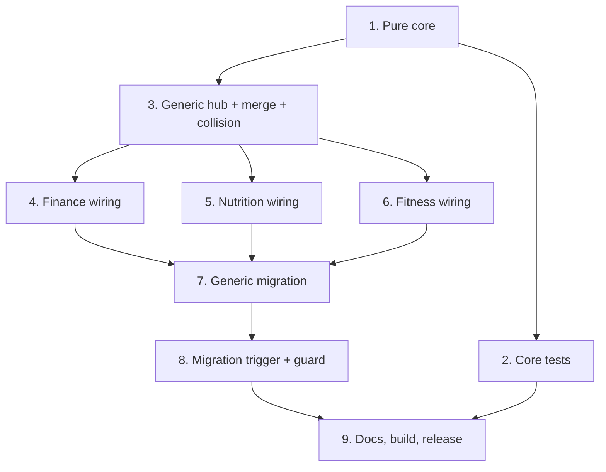

# Implementation Plan

## Overview

Implements readable per-item note names + module-prefixed monthly hub notes + wikilinks for Finance, Nutrition, and Fitness, plus an idempotent, body-preserving, guarded retroactive migration. Work is confined to the data layer plus a small plugin-host wiring for the migration command/guard. Frontmatter stays the source of truth; filenames and hubs are derived, regenerable views. Order: build and test the pure core first, then the generic hub/migration helpers, then wire each module, then the migration trigger, then docs/build/release.

## Task Dependency Graph



```json
{
  "waves": [
    { "wave": 1, "tasks": ["1"] },
    { "wave": 2, "tasks": ["2", "3"] },
    { "wave": 3, "tasks": ["4", "5", "6"] },
    { "wave": 4, "tasks": ["7"] },
    { "wave": 5, "tasks": ["8"] },
    { "wave": 6, "tasks": ["9"] }
  ]
}
```

## Tasks

- [x] 1. Shared readable-notes core (pure functions)
  - Add `src/readablenotes.ts` with `INVALID_FILENAME_CHARS`, `sanitizeSegment(raw)`, `formatAmount(n)`, `monthKeyOf(date)`, `monthName(monthKey)`, and `monthHubTitle(module, monthKey)` producing `"<Module> <YYYY-MM MonthName>"`.
  - Add per-module title builders: `financeTxTitle`, `mealLogTitle({mealName, kcal, date})`, `workoutTitle({splitName, minutes, date})`.
  - Keep all functions pure/deterministic; no Obsidian imports.
  - _Requirements: 1.1, 1.2, 1.3, 1.4, 1.5, 1.6, 1.7, 1.8, 1.9, 8.1, 9.1, 10.1_

- [x] 2. Property/unit tests for the pure core
  - [x] 2.1 Add a minimal test setup (fast-check + a lightweight ts runner or jest+ts-jest) as devDependencies; add an `npm test` script; do not affect the plugin build.
  - [x] 2.2 Tests: sanitize determinism + safety (no invalid chars/whitespace/edge hyphens, accents preserved, symbol-only → empty); `formatAmount` matches `^\d+\.\d{2}$` and equals `Math.abs(n).toFixed(2)`; title builders deterministic, marker-free, note/segment omission; `monthHubTitle` uniqueness across modules.
  - _Requirements: 1.4, 1.6, 1.7, 1.8, 1.9, 8.1_

- [x] 3. Generic month-hub + collision + body-merge helpers in the data store
  - Add `mergeBody(body, hubLink)` (preserve all user lines, add hub link at most once — idempotent fixpoint).
  - Add a generic `syncMonthHub(moduleCfg, monthKey)` driven by a per-module config `{ folder, hubFolder, module, loadItems, summaryBody }`; writes via `writeIfChanged` comparing body only (ignore volatile `generated`); removes the hub when the month is empty.
  - Reuse existing `uniquePath` for collision-free names (drop the random suffix on create).
  - _Requirements: 2.1, 2.2, 2.3, 3.1, 3.2, 3.6, 3.7, 8.3_

- [x] 4. Finance module wiring
  - [x] 4.1 Rewrite `addTransaction` to use `financeTxTitle` + `uniquePath`, append `[[Finance <YYYY-MM MonthName>]]` to the body, then `syncMonthHub(finance, month)`.
  - [x] 4.2 Finance hub summary builder: Income / Expenses / Balance in configured currency + linked, date-sorted transaction list.
  - [x] 4.3 Add `deleteTransaction` hub sync (remove hub if month empties).
  - _Requirements: 1.1, 3.3, 3.4, 3.5, 4.1, 4.2, 8.2_

- [x] 5. Nutrition module wiring
  - [x] 5.1 `logMeal`: write `meal_name` frontmatter; name the file `mealLogTitle`; append `[[Nutrition <YYYY-MM MonthName>]]`; then `syncMonthHub(nutrition, month)`.
  - [x] 5.2 Nutrition hub summary: total calories, avg/day, days logged, total protein/carbs + linked log list.
  - [x] 5.3 `deleteMealLog` hub sync.
  - _Requirements: 9.1, 9.2, 9.3, 9.4, 9.5, 9.6, 9.7, 9.8_

- [x] 6. Fitness module wiring
  - [x] 6.1 `logWorkout`: resolve split display name (config → fallback id); name the file `workoutTitle`; append `[[Fitness <YYYY-MM MonthName>]]`; then `syncMonthHub(fitness, month)`.
  - [x] 6.2 Fitness hub summary: workout count, total minutes, per-split breakdown + linked session list.
  - [x] 6.3 `deleteWorkout` hub sync.
  - _Requirements: 10.1, 10.2, 10.3, 10.4, 10.5, 10.6, 10.7_

- [x] 7. Generic migration (idempotent, body-preserving, guarded)
  - [x] 7.1 Add `migrateReadableNotes(moduleCfg, {dryRun})`: per file — read frontmatter, ensure a stable `id`, compute desired name, skip if already named `<desired>`/`<desired> N`, else backlink-safe rename via `app.fileManager.renameFile`; `mergeBody` for the hub link; collect a `MigrationReport`; skip malformed frontmatter with a warning; catch per-file rename errors and continue.
  - [x] 7.2 Regenerate every touched month hub per module after processing.
  - [x] 7.3 Verify load-invariance for all three modules (data derived from frontmatter only; `id` ensured before rename).
  - _Requirements: 5.1, 5.2, 5.3, 5.4, 5.5, 5.6, 5.7, 5.8, 5.9, 5.13, 6.1, 6.2, 6.3, 11.1, 11.3_

- [x] 8. Migration trigger + guard in the plugin
  - Add `readableNotesSchema` to plugin settings; add command "Momentum: migrate notes to readable names" that runs all three modules and shows an aggregate Notice; add a one-time guarded auto-run on `onLayoutReady` (set the guard only on success; leave unset on failure so the command can retry).
  - _Requirements: 5.10, 5.11, 5.12, 5.14, 11.2, 11.4_

- [-] 9. Docs, build, and release
  - Update README (readable notes + monthly hubs + migration command + graph tip); add a "What's new" changelog entry; lint + build (community) and `build:local`; verify `child_process` absent from the community `main.js`; deploy to the vault; bump version; commit/push/tag; update the `local` branch; verify release attestation.
  - _Requirements: 7.1, 7.2, 7.3_

## Notes

- Frontmatter is the source of truth for all three item types; renames are data-safe (verified for `loadTransactions`, `loadMealLogs`, `loadWorkouts`).
- Hub basenames are module-prefixed (`Finance/Nutrition/Fitness <YYYY-MM MonthName>`) so wikilinks never collide.
- Migration is idempotent and preserves user-added body lines (e.g. a manual `Hub: [[Hub - Personal]]`); the explicit command is the primary path, with a one-time guarded auto-run as convenience. Recommend a vault backup before first run.
- The feature is data-layer only and must not depend on the personal `local` branch kiro-cli bridge (works in the community build).
- Correctness properties P1–P15 in design.md map to the referenced requirements and guide the tests in task 2.
