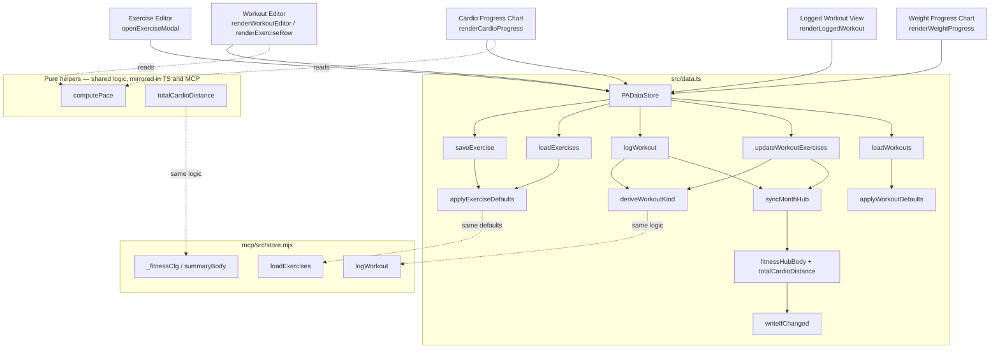
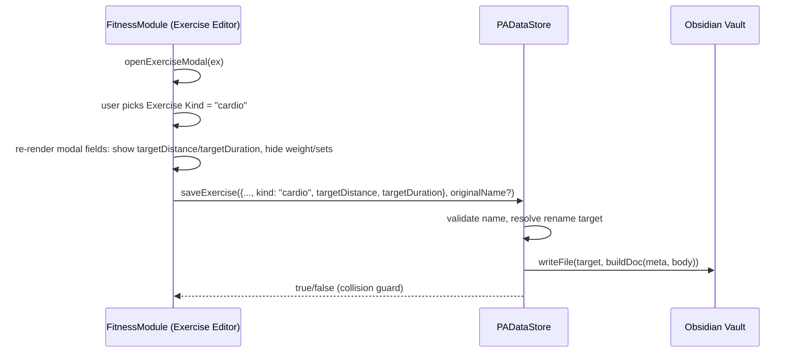
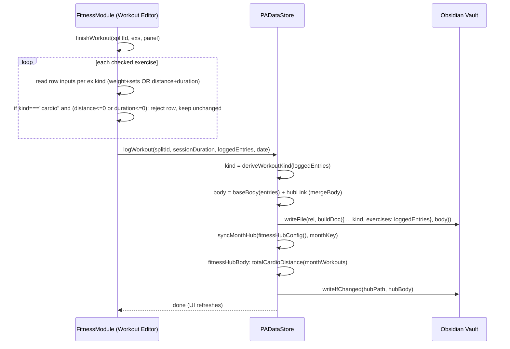
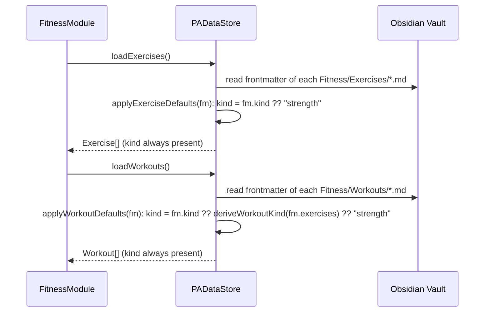

# Design Document: Fitness Cardio

## Overview

Today every `Exercise` in the Fitness module is implicitly a strength movement: it carries a required `weight` (kg) and `sets` (e.g. `3x10`), grouped into a `Split` that represents a muscle group. `Workout` and `WorkoutExercise` mirror the same shape. There is no field for distance, pace, or activity type, so cardio activities (running, cycling, rowing, etc.) have no correct representation anywhere in the stack: the Exercise Editor, the Workout Editor, the Logged Workout View, or the progress chart.

This feature adds an `Exercise Kind` (`"strength"` | `"cardio"`) to `Exercise`, a derived `Workout Kind` (`"strength"` | `"cardio"` | `"mixed"` | `"empty"`) to `Workout`, and cardio-specific fields (`targetDistance`/`targetDuration` on the template, `distance`/`duration` on logged entries, with pace computed on the fly) alongside the existing strength fields. The Exercise Editor, Workout Editor, and Logged Workout View switch which fields they show per row based on kind. A new Cardio Progress Chart sits next to the existing Weight Progress Chart. The Fitness Month Hub gains an optional total-distance line. Every change is an additive, defaulted schema extension — no migration step, no destructive rewrite — and every data-layer change is mirrored in the MCP Fitness Store (`mcp/src/store.mjs`).

The design touches `src/types.ts` (schema), `src/data.ts` (Fitness Data Store: load/save/hub), `src/modules/fitness.ts` (UI), `src/ui.ts` (minimal `FormModal`/`FieldSpec` extension for conditional fields), and `mcp/src/store.mjs` (parity). It reuses existing primitives already in the codebase: `buildDoc`, `patchFrontmatter`, `uniquePath`, `writeIfChanged`, `mergeBody`, `workoutTitle`, `monthHubTitle`, `monthKeyOf`, `syncMonthHub` (`src/readablenotes.ts` / `src/data.ts`). Scope is Fitness only.

---

## Architecture



Key idea: **`kind` is the discriminant, defaulted on read, never required on write.** Every load path (`loadExercises`, `loadWorkouts`) applies `kind: "strength"` when the frontmatter field is absent, so pre-existing vaults keep working with zero migration. Every save path preserves whatever fields already exist in frontmatter and only adds/updates the fields relevant to the record's own kind — it never strips a field belonging to the other kind, which keeps old strength data byte-identical across the extension (Req 7.3/7.4).

---

## Sequence Diagrams

### Create/edit a cardio Exercise



### Log a mixed workout (strength + cardio entries)



### Load exercises/workouts with defaults (backward compatibility)



---

## Components and Interfaces

### Component: Schema extension (`src/types.ts`)

**Purpose**: Add the discriminant and cardio fields as optional, defaulted properties. No field is removed or made required.

```typescript
export type ExerciseKind = "strength" | "cardio";
export type WorkoutKind = "strength" | "cardio" | "mixed" | "empty";

export interface Exercise {
  name: string;
  split: string;
  type: string;
  muscle: string;
  sets: string;           // strength only; ignored/blank when kind === "cardio"
  weight: number;         // strength only; ignored/0 when kind === "cardio"
  howto: string;
  path?: string;
  kind: ExerciseKind;            // NEW — always present after load (defaulted)
  targetDistance?: number;       // NEW — km; cardio only
  targetDuration?: number;       // NEW — minutes; cardio only
}

export interface WorkoutExercise {
  exercise: string;
  weight: number;         // strength only
  sets: string;            // strength only
  feel?: string;
  oldWeight?: number;
  kind?: ExerciseKind;     // NEW — copied from Exercise.kind at log time; defaults to "strength" if absent (legacy entries)
  distance?: number;       // NEW — km; cardio only
  duration?: number;       // NEW — minutes; cardio only (entry-level, distinct from Workout.duration which is session-level)
}

export interface Workout {
  id: string;
  date: string;
  split: string;
  duration: number;        // session-level minutes; unchanged meaning
  exercises: WorkoutExercise[];
  path: string;
  kind: WorkoutKind;       // NEW — always present after load (derived/defaulted)
}
```

**Responsibilities**:
- `kind` on `Exercise` and `Workout` is never `undefined` once returned by the Fitness Data Store — the load path fills it in (Req 1.2, 3.5, 7.1, 7.2).
- `WorkoutExercise.kind` is optional in the TS type because legacy frontmatter entries won't have it; call sites that need certainty use `we.kind ?? "strength"`.
- `targetDistance`/`targetDuration`/`distance`/`duration` are plain optional numbers — no new nested types, keeping frontmatter flat and consistent with the rest of the schema.

### Component: Pure kind/pace/distance helpers (shared logic)

**Purpose**: Deterministic, side-effect-free functions used by both the plugin (TypeScript) and the MCP store (mirrored by hand in `.mjs`, since the MCP has no build step and cannot import TS). Defined once in `src/data.ts` (or a small shared module, see Dependencies) and re-implemented with identical semantics in `mcp/src/store.mjs`.

```typescript
/** Pace in minutes/km, rounded to 1 decimal; null when distance or duration is not > 0 (Req 2.2, 2.3). */
export function computePace(distanceKm: number, durationMin: number): number | null {
  if (!(distanceKm > 0) || !(durationMin > 0)) return null;
  return Math.round((durationMin / distanceKm) * 10) / 10;
}

/** Derives a Workout's kind from its logged entries (Req 3.1-3.4). */
export function deriveWorkoutKind(entries: Array<{ kind?: ExerciseKind }>): WorkoutKind {
  if (entries.length === 0) return "empty";
  const kinds = new Set(entries.map((e) => e.kind ?? "strength"));
  if (kinds.size > 1) return "mixed";
  return kinds.has("cardio") ? "cardio" : "strength";
}

/** Sum of distance across all cardio entries in the given workouts (Req 6.1). */
export function totalCardioDistance(workouts: Array<{ exercises: Array<{ kind?: ExerciseKind; distance?: number }> }>): number {
  let total = 0;
  for (const w of workouts) {
    for (const e of w.exercises) {
      if ((e.kind ?? "strength") === "cardio") total += Number(e.distance) || 0;
    }
  }
  return total;
}
```

**Responsibilities**:
- `computePace`: pure, deterministic, never throws, never divides by zero (Req 2.2, 2.3).
- `deriveWorkoutKind`: pure, deterministic, total function over any array including empty (Req 3.1-3.4); treats an entry with no `kind` as `"strength"` so legacy `WorkoutExercise` rows read as strength (Req 3.5 applies at the Workout level, this is the entry-level analog needed to make derivation well-defined for legacy data).
- `totalCardioDistance`: pure, deterministic, sums only cardio entries, returns `0` for a workout list with no cardio (Req 6.3 relies on the caller checking `> 0` before rendering the line, not on this function itself).

### Component: Fitness Data Store extensions (`src/data.ts`)

```typescript
/** Applied on every loadExercises() row so `kind` is always present (Req 1.2, 7.1). */
function applyExerciseDefaults(m: FM): { kind: ExerciseKind; targetDistance?: number; targetDuration?: number } {
  const kind: ExerciseKind = str(m.kind) === "cardio" ? "cardio" : "strength";
  return {
    kind,
    targetDistance: m.target_distance != null ? num(m.target_distance) : undefined,
    targetDuration: m.target_duration != null ? num(m.target_duration) : undefined,
  };
}

/** Applied on every loadWorkouts() row so `kind` is always present (Req 3.5, 7.1). */
function applyWorkoutDefaults(fm: FM, exercises: WorkoutExercise[]): WorkoutKind {
  const stored = str(fm.kind);
  if (stored === "strength" || stored === "cardio" || stored === "mixed" || stored === "empty") return stored;
  return deriveWorkoutKind(exercises); // legacy record: derive instead of blindly defaulting to "strength"
}

// loadExercises(): unchanged shape, plus:
//   ...applyExerciseDefaults(m)
// loadWorkouts(): unchanged shape, plus:
//   kind: applyWorkoutDefaults(m, exercises)

// saveExercise(ex, originalName?): meta gains, only when relevant:
//   kind: ex.kind || "strength",
//   ...(ex.kind === "cardio" ? { target_distance: ex.targetDistance || 0, target_duration: ex.targetDuration || 0 } : {}),
// Existing fields (name, split, muscle, sets, weight, equipment, howto, type, modified) are written exactly as today —
// no field is omitted, so a strength Exercise's frontmatter is unchanged apart from the added `kind: "strength"` (Req 7.3).

// logWorkout(splitId, duration, exercises, date): meta gains:
//   kind: deriveWorkoutKind(exercises),
// exercises entries already carry their own `kind`/`distance`/`duration` from the caller (Workout Editor), so no
// extra mapping is needed here beyond what finishWorkout/logWorkoutForDate already assemble.

// updateWorkoutExercises(workout, exercises): patchFrontmatter gains:
//   fm.kind = deriveWorkoutKind(exercises);
// (fm.exercises and fm.modified already updated as today — Req 4.5, 4.6 flow through this same method for both kinds.)
```

**Responsibilities**:
- `loadExercises`/`loadWorkouts` never return an `Exercise`/`Workout` without a `kind` (Req 1.2, 3.5, 7.1, 7.2).
- `saveExercise` writes `kind` and, only for cardio, the two target fields — it never writes `target_distance`/`target_duration` keys for a strength Exercise, keeping strength frontmatter minimal and unchanged (Req 7.3).
- `updateWorkoutExercises` re-derives `kind` on every save so editing entries (e.g. changing which exercises are logged) keeps the Workout's `kind` consistent, satisfying Req 3 continuously, not just at creation time.
- Per Req 7.4: `patchFrontmatter` (existing helper) mutates the parsed frontmatter object in place and rewrites the full file — it inherently cannot "silently drop" a field it never reads, because it operates on the whole parsed object, not a manually reconstructed subset. `saveExercise`, by contrast, does construct a full `meta` object from scratch; the design above enumerates every existing key it must keep, so the property below can verify none are lost. If a future change to `saveExercise` needs to add a field it can't confidently preserve, it must use `patchFrontmatter` instead of extending the manual `meta` object, per this requirement.

### Component: Fitness Month Hub — cardio summary

```typescript
// fitnessHubBody(items: Workout[], monthKey: string): extends today's body with, only if > 0:
//   `**Total distance:** ${km.toFixed(2)} km\n`
// placed after "Total minutes" and before "## By split", using totalCardioDistance(items).
```

**Responsibilities**:
- Adds the line only when `totalCardioDistance(items) > 0` (Req 6.2, 6.3).
- Reuses the existing per-split breakdown unchanged — cardio and strength sessions both still count toward "workouts" and "minutes" per split, since a Split can mix kinds (Req 6 does not ask to split the breakdown by kind, only to add a total-distance figure).
- Req 6.4 ("cannot determine... log the failure and omit the line"): `totalCardioDistance` is a pure function over already-loaded data and cannot itself fail; the fallible step is `loadWorkouts()`/`loadConfig()` inside `fitnessHubBody`'s caller. The design wraps the distance computation in a `try { } catch (e) { logToFile(...); return 0; }` inside `fitnessHubBody` specifically around the summation, so a malformed individual workout entry (e.g. `NaN` distance from corrupt frontmatter) cannot abort the whole hub regeneration — it is logged and treated as contributing zero distance, and the line is omitted only if the resulting total is 0.

### Component: Exercise Editor — conditional fields (`src/ui.ts`, `src/modules/fitness.ts`)

**Problem**: `FormModal` renders `FieldSpec[]` once in `onOpen()` and has no reactivity — fields can't hide/show when another field's value changes. Req 1.4/1.5 need exactly that (weight/sets vs targetDistance/targetDuration based on the `kind` dropdown).

**Minimal extension** (smallest change that satisfies the requirement without a broader modal rewrite):

```typescript
interface FieldSpec {
  key: string;
  label: string;
  type: FieldType;
  value?: string | number | boolean;
  options?: Array<{ value: string; label: string }>;
  placeholder?: string;
  visibleWhen?: (values: Record<string, string>) => boolean; // NEW — optional; field always visible if omitted
}
```

`FormModal.onOpen()` change: when rendering a field whose `visibleWhen` returns `false` for the current `this.values`, skip creating its `Setting` (as today, for every field). After every field's `onChange` handler updates `this.values[f.key]`, call a new `private refreshVisibility(): void` that re-evaluates every field's `visibleWhen` and toggles that field's `Setting.settingEl` display (`show()`/`hide()`) — no full re-render, no loss of focus/cursor in other inputs, no reflow of unrelated fields.

```typescript
private refreshVisibility(): void {
  this.fieldEls.forEach(({ field, el }) => {
    const visible = !field.visibleWhen || field.visibleWhen(this.values);
    el.toggleClass("pa-hidden", !visible); // display:none via existing utility class, or a new one-liner
  });
}
```

`openExerciseModal` then declares:

```typescript
{ key: "kind", label: "Kind", type: "dropdown",
  options: [{ value: "strength", label: "Strength" }, { value: "cardio", label: "Cardio" }],
  value: ex?.kind || "strength" },
{ key: "sets", label: "Sets x reps", type: "text", value: ex?.sets || "3x10",
  visibleWhen: (v) => v.kind !== "cardio" },
{ key: "weight", label: "Weight (kg)", type: "number", value: ex?.weight ?? 0,
  visibleWhen: (v) => v.kind !== "cardio" },
{ key: "targetDistance", label: "Target distance (km)", type: "number", value: ex?.targetDistance ?? 0,
  visibleWhen: (v) => v.kind === "cardio" },
{ key: "targetDuration", label: "Target duration (min)", type: "number", value: ex?.targetDuration ?? 0,
  visibleWhen: (v) => v.kind === "cardio" },
```

**Responsibilities**:
- `visibleWhen` is optional and backward-compatible: every other `FormModal` caller in the codebase (recurring cost modal, split rename, etc.) omits it and renders exactly as before — zero behavior change for unrelated modals.
- A hidden field's value is still tracked in `this.values` (unchanged) and still submitted in `onSubmit`; `openExerciseModal`'s submit handler decides which of the submitted values to persist based on the submitted `kind`, so stale/irrelevant values (e.g. a leftover `weight` typed before switching to cardio) are simply not written by the save logic below — they are never surfaced to the user as "lost data" because the corresponding field was hidden when they were on the cardio path.

### Component: Workout Editor / Logged Workout View — per-row field selection (`src/modules/fitness.ts`)

```typescript
// renderExerciseRow(tbody, ex): column set depends on ex.kind.
//   ex.kind === "strength": weight input, sets input (unchanged from today).
//   ex.kind === "cardio":   distance input (km), duration input (min), and a read-only pace cell
//                           computed via computePace(distance, duration) — "—" when null.
// Table header (renderWorkoutEditor) becomes kind-aware: builds the header row from the union of
// kinds present among `exs` for that split, e.g. ["✓","Exercise","Weight","Sets","Distance","Duration","Pace","How-to",""]
// when the split mixes kinds, omitting the columns no exercise in the split needs.
```

```typescript
// renderLoggedWorkout(panel, w): same per-row switch on we.kind ?? "strength" for weight/sets vs distance/duration
// input pairs, plus a computed, non-editable pace display next to duration for cardio rows.
```

```typescript
// persistRowEdits / finishWorkout / logWorkoutForDate: read weight+sets OR distance+duration per exercise
// based on ex.kind, exactly mirroring the read-path switch. finishWorkout additionally applies Req 2.4:
//   if ex.kind === "cardio" and (distance <= 0 or duration <= 0): skip persisting that exercise's Exercise-level
//   template change (saveExercise) AND do not add it to `logged` — the row is treated as not filled in, matching
//   "reject the save and leave that entry unchanged" without blocking the rest of the workout from being logged.
```

**Responsibilities**:
- Column visibility and input handling are entirely driven by `ex.kind`/`we.kind ?? "strength"`, never by which `Split` is active — a Split may freely mix strength and cardio Exercises (per the Glossary), so the switch must be per-row, not per-table (Req 4.1-4.4).
- The cardio-specific validation in Req 2.4 lives in the UI layer (`finishWorkout`/`logWorkoutForDate`), consistent with where the existing weight/sets read-and-guard logic already lives — the Fitness Data Store's `logWorkout` receives only already-valid entries and does not re-validate (single responsibility: UI validates input, store persists trusted data).

### Component: Cardio Progress Chart (`src/modules/fitness.ts`)

```typescript
/** Sibling to renderWeightProgress: same split selector, same drawLineChart, plotting distance instead of weight. */
private renderCardioProgress(root: HTMLElement, exercises: Exercise[], workouts: Workout[]): void {
  const card = root.createDiv({ cls: "pa-panel" });
  card.createEl("h3", { text: "🏃 Cardio progress", cls: "pa-panel-title" });
  const splitWorkouts = workouts.filter((w) => w.split === this.weightSplit).sort((a, b) => a.date.localeCompare(b.date));
  const labels = splitWorkouts.map((w) => w.date.slice(5));
  const cardioExs = exercises.filter((e) => e.split === this.weightSplit && e.kind === "cardio");
  const series: LineSeries[] = cardioExs.map((ex, i) => ({
    name: ex.name,
    color: SERIES_COLORS[i % SERIES_COLORS.length],
    values: splitWorkouts.map((w) => {
      const found = w.exercises.find((we) => we.exercise === ex.name);
      return found ? (found.distance ?? null) : null;
    }),
  })).filter((s) => s.values.some((v) => v != null));
  drawLineChart(card, labels, series, { height: 220 }); // series === [] renders an empty chart, satisfying Req 5.4
}
```

**Responsibilities**:
- Shares the split selector (`this.weightSplit`) with `renderWeightProgress` so switching the dropdown updates both charts consistently — one split, two lenses (Req 5.1, 5.2).
- Always renders the panel; `drawLineChart` with an empty `series` array is the existing, already-supported "no data" rendering path used elsewhere in the codebase (e.g. Finance trend with no expenses), so no new empty-state component is needed (Req 5.4).
- `renderWeightProgress` gains one filter: `exercises.filter((e) => e.split === this.weightSplit && e.kind !== "cardio")` (or equivalently `e.kind === "strength"`, since those are the only two values) so a cardio Exercise never contributes a (weight-less) series to the strength chart (Req 5.3).

### Component: MCP Fitness Store parity (`mcp/src/store.mjs`)

```javascript
// loadExercises(): each pushed record gains
//   kind: str(m.kind) === "cardio" ? "cardio" : "strength",
//   targetDistance: m.target_distance != null ? num(m.target_distance) : undefined,
//   targetDuration: m.target_duration != null ? num(m.target_duration) : undefined,

// loadWorkouts(): each pushed record gains
//   kind: (["strength","cardio","mixed","empty"].includes(str(m.kind)) ? str(m.kind) : deriveWorkoutKind(coerce(m.exercises, [])))

// logWorkout({ split, duration, date, exercises }): meta gains
//   kind: deriveWorkoutKind(exercises),

// _fitnessCfg().summaryBody: after computing totalMinutes, adds
//   const totalDistance = totalCardioDistance(sorted);
//   ...and includes "**Total distance:** N.NN km\n" only when totalDistance > 0, in the same position as the TS side.

// New pure helpers computePace, deriveWorkoutKind, totalCardioDistance are copied verbatim (same algorithm,
// vanilla JS syntax) into mcp/src/naming.mjs or store.mjs — see Dependencies for why this is a hand-mirror, not
// a shared import.
```

**Responsibilities**:
- Every behavior in Requirement 8 is satisfied by literally reusing the same three pure functions' logic, so "same total distance figure" (Req 8.3) holds by construction as long as the two copies stay in sync — see Error Handling for the drift-detection response required by Req 8.4.

---

## Data Models

### Exercise note frontmatter (`Fitness/Exercises/<name>.md`)

Strength (unchanged from today, plus the new `kind` key):

```yaml
---
name: "Supino Máquina"
split: "A"
muscle: "Peito"
sets: "3x10"
weight: 40
equipment: "machine"
howto: ""
type: "exercise"
kind: "strength"
modified: "2026-08-21T10:00:00.000Z"
---
```

Cardio (new — `sets`/`weight` omitted since they carry no meaning; `type: "exercise"` and `equipment` stay for now, unused by cardio but harmless):

```yaml
---
name: "Corrida"
split: "E"
muscle: ""
equipment: "outdoor"
howto: ""
type: "exercise"
kind: "cardio"
target_distance: 5
target_duration: 30
modified: "2026-08-21T10:00:00.000Z"
---
```

**Rules**:
- `kind` defaults to `"strength"` when absent (legacy files) — Req 1.2.
- `target_distance`/`target_duration` are only meaningful, and only written, when `kind === "cardio"` — Req 1.6.
- All existing strength keys continue to be written exactly as before — Req 7.3.

### Workout note frontmatter (`Fitness/Workouts/<title>.md`)

Mixed workout example (new `kind: "mixed"` at the top level, and per-entry `kind`/cardio fields):

```yaml
---
id: 1755781200000
type: "workout-log"
date: "2026-08-21"
split: "E"
duration: 42
kind: "mixed"
exercises:
  - exercise: "Supino Máquina"
    weight: 42
    sets: "3x10"
    feel: "good"
    kind: "strength"
  - exercise: "Corrida"
    distance: 5.2
    duration: 28
    kind: "cardio"
logged: "2026-08-21T11:30:00.000Z"
---
```

**Rules**:
- `kind` at the Workout level is derived, never user-entered directly — Req 3.
- A `WorkoutExercise` entry with no `kind` (legacy data written before this feature) is treated as `"strength"` wherever kind matters (`deriveWorkoutKind`, row rendering) — Req 7.1.
- `duration` at the top level remains the whole-session minutes (unchanged); the per-entry `duration` (cardio only) is a different, narrower figure (that one exercise's time) and both can coexist without ambiguity because they're on different objects.

### Fitness Month Hub body (excerpt, cardio-active month)

```markdown
# Fitness — August 2026

**Workouts:** 12
**Total minutes:** 480 min
**Total distance:** 21.40 km

## By split

- Cardio: 4 workouts, 120 min
- Peito/Ombro/Tríceps: 8 workouts, 360 min

## Sessions

- [[Cardio-30min-2026-08-03]]
- [[PeitoOmbroTriceps-45min-2026-08-05]]
...
```

**Rules**:
- The `**Total distance:**` line appears only when `totalCardioDistance(monthWorkouts) > 0` — Req 6.2, 6.3.
- Placed between `Total minutes` and `## By split` (a fixed, deterministic position) so the hub body stays diffable/deterministic — required for `writeIfChanged` to correctly no-op on unrelated regenerations.

---

## Algorithmic Pseudocode

### computePace

```typescript
export function computePace(distanceKm: number, durationMin: number): number | null {
  if (!(distanceKm > 0) || !(durationMin > 0)) return null;
  return Math.round((durationMin / distanceKm) * 10) / 10;
}
```

**Preconditions:** `distanceKm`, `durationMin` are numbers (may be 0, negative, `NaN`).
**Postconditions:**
- Returns `null` iff `distanceKm <= 0 || durationMin <= 0 || isNaN(distanceKm) || isNaN(durationMin)` (since `NaN > 0` is `false`, `!(NaN > 0)` is `true`, so `NaN` inputs correctly yield `null` rather than `NaN` output).
- Otherwise returns a finite number rounded to 1 decimal, equal to `round(durationMin/distanceKm * 10) / 10`.

**Worked examples:**
| distanceKm | durationMin | pace |
|---|---|---|
| 5 | 30 | 6.0 |
| 5.2 | 28 | 5.4 |
| 0 | 30 | null |
| 5 | 0 | null |
| -1 | 30 | null |

### deriveWorkoutKind

```typescript
export function deriveWorkoutKind(entries: Array<{ kind?: ExerciseKind }>): WorkoutKind {
  if (entries.length === 0) return "empty";
  const kinds = new Set(entries.map((e) => e.kind ?? "strength"));
  if (kinds.size > 1) return "mixed";
  return kinds.has("cardio") ? "cardio" : "strength";
}
```

**Preconditions:** `entries` is any array (possibly empty) of objects with an optional `kind`.
**Postconditions:**
- `entries.length === 0 ⟺ result === "empty"` (Req 3.4).
- `entries.length > 0 && every e has kind "strength" (or undefined) ⟺ result === "strength"` (Req 3.1).
- `entries.length > 0 && every e has kind "cardio" ⟺ result === "cardio"` (Req 3.2).
- `entries.length > 0 && mix of strength and cardio ⟺ result === "mixed"` (Req 3.3).
- Deterministic and total (never throws) for any input array.

**Worked examples:**
| entries (kinds) | result |
|---|---|
| `[]` | `"empty"` |
| `["strength"]` | `"strength"` |
| `[undefined, "strength"]` | `"strength"` |
| `["cardio", "cardio"]` | `"cardio"` |
| `["strength", "cardio"]` | `"mixed"` |

### totalCardioDistance

```typescript
export function totalCardioDistance(workouts: Array<{ exercises: Array<{ kind?: ExerciseKind; distance?: number }> }>): number {
  let total = 0;
  for (const w of workouts) {
    for (const e of w.exercises) {
      if ((e.kind ?? "strength") === "cardio") total += Number(e.distance) || 0;
    }
  }
  return total;
}
```

**Preconditions:** `workouts` is any array of objects each with an `exercises` array of entries with optional `kind`/`distance`.
**Postconditions:**
- Result equals the sum of `distance` (or 0 when missing/`NaN`) over exactly the entries whose `kind === "cardio"`.
- Strength entries (or entries with `kind` absent, defaulted to `"strength"`) never contribute.
- Returns `0` for an empty list or a list with no cardio entries (Req 6.3's caller relies on this to decide omission).

### applyExerciseDefaults / applyWorkoutDefaults (backward compatibility)

```typescript
function applyExerciseDefaults(m: FM): Pick<Exercise, "kind" | "targetDistance" | "targetDuration"> {
  const kind: ExerciseKind = str(m.kind) === "cardio" ? "cardio" : "strength";
  return {
    kind,
    targetDistance: m.target_distance != null ? num(m.target_distance) : undefined,
    targetDuration: m.target_duration != null ? num(m.target_duration) : undefined,
  };
}

function applyWorkoutDefaults(m: FM, exercises: WorkoutExercise[]): WorkoutKind {
  const stored = str(m.kind);
  if (stored === "strength" || stored === "cardio" || stored === "mixed" || stored === "empty") return stored as WorkoutKind;
  return deriveWorkoutKind(exercises);
}
```

**Preconditions:** `m` is the raw frontmatter object of an Exercise or Workout file; may be missing any key.
**Postconditions:**
- `applyExerciseDefaults(m).kind` is always exactly `"strength"` or `"cardio"`, never `undefined` (Req 1.1, 1.2).
- `applyWorkoutDefaults` returns a stored valid `kind` verbatim when present (so a future manual edit or a value written by this feature round-trips exactly); otherwise derives from the entries, which for pre-feature files (no entry `kind`) yields `"strength"` when non-empty and `"empty"` when empty — a strictly more accurate default than blindly always returning `"strength"` (Req 3.5, 7.1, 7.2).

### saveExercise (revised — additive only)

```typescript
async saveExercise(ex: Exercise, originalName?: string): Promise<boolean> {
  // ...unchanged rename-guard logic...
  const meta: FM = {
    name: ex.name, split: ex.split || "A", muscle: ex.muscle || "",
    sets: ex.sets || "3x10", weight: ex.weight || 0, equipment: ex.type || "machine",
    howto: ex.howto || "", type: "exercise", modified: new Date().toISOString(),
    kind: ex.kind || "strength",
  };
  if ((ex.kind || "strength") === "cardio") {
    meta.target_distance = ex.targetDistance || 0;
    meta.target_duration = ex.targetDuration || 0;
  }
  await this.writeFile(targetRel, this.buildDoc(meta, `# ${ex.name}\n`));
  // ...unchanged rename cleanup...
}
```

**Preconditions:** `ex` is a fully-formed `Exercise` (with `kind` always populated by the caller via the Exercise Editor's default `"strength"`).
**Postconditions:**
- Every key written today (`name`, `split`, `muscle`, `sets`, `weight`, `equipment`, `howto`, `type`, `modified`) is still written, unconditionally (Req 7.3).
- `kind` is always written.
- `target_distance`/`target_duration` are written iff `kind === "cardio"` — a strength Exercise's frontmatter never gains these two keys (Req 1.4 mirrored at the storage layer, keeping strength records minimal).

### logWorkout (revised) / updateWorkoutExercises (revised)

```typescript
async logWorkout(splitId: string, duration: number, exercises: WorkoutExercise[], date: string = todayLocal()): Promise<void> {
  // ...unchanged splitName/hubLink/body assembly...
  const meta: FM = {
    id: Date.now(), type: "workout-log", date, split: splitId, duration, exercises,
    kind: deriveWorkoutKind(exercises), // NEW
    logged: new Date().toISOString(),
  };
  // ...unchanged write + syncMonthHub...
}

async updateWorkoutExercises(workout: Workout, exercises: WorkoutExercise[]): Promise<void> {
  const f = this.app.vault.getAbstractFileByPath(workout.path);
  if (!(f instanceof TFile)) return;
  await this.patchFrontmatter(f, (fm) => {
    fm.exercises = exercises;
    fm.kind = deriveWorkoutKind(exercises); // NEW
    fm.modified = new Date().toISOString();
  });
}
```

**Preconditions:** `exercises` entries already carry whatever `kind`/`distance`/`duration`/`weight`/`sets` fields the UI validated before calling.
**Postconditions:**
- The written `kind` frontmatter field always equals `deriveWorkoutKind(exercises)` for the exact `exercises` array being written — never stale, never independently editable (Req 3 holds continuously across both creation and later edits).

### fitnessHubBody (revised — adds the total-distance line, fault-tolerant)

```typescript
private async fitnessHubBody(items: Workout[], monthKey: string): Promise<string> {
  // ...unchanged sorting, workoutCount, totalMinutes, splitRows computation...
  let totalDistance = 0;
  try {
    totalDistance = totalCardioDistance(sorted);
  } catch (e) {
    this.logDebug(`fitnessHubBody: totalCardioDistance failed for ${monthKey}: ${e}`); // Req 6.4
    totalDistance = 0;
  }

  let body = `# Fitness — ${monthName(monthKey)} ${year}\n\n`;
  body += `**Workouts:** ${workoutCount}\n`;
  body += `**Total minutes:** ${int(totalMinutes)} min\n`;
  if (totalDistance > 0) body += `**Total distance:** ${totalDistance.toFixed(2)} km\n`;
  body += `\n## By split\n\n`;
  // ...unchanged remainder...
}
```

**Preconditions:** `items` is the month's loaded `Workout[]` (already defaulted by `loadWorkouts`, so every entry has a `kind`, even if defaulted).
**Postconditions:**
- The distance line appears iff `totalDistance > 0` (Req 6.2, 6.3).
- A thrown error while summing distance is caught, logged, and treated as zero distance rather than propagating and aborting the whole hub regeneration (Req 6.4) — because `totalCardioDistance` as specified is in fact total and cannot throw for well-typed input, this branch specifically protects against malformed frontmatter producing non-numeric `distance`/`kind` values that slip past `num()`'s coercion in unexpected ways (defensive; the `try/catch` is the contractual guarantee Req 6.4 asks for, independent of whether today's implementation can currently trigger it).

---

## Error Handling

### Legacy Exercise/Workout with no `kind` field
**Condition:** a file written before this feature exists in the vault.
**Response:** `applyExerciseDefaults`/`applyWorkoutDefaults` supply `"strength"` (or a correctly-derived value for Workouts), transparently, on every load.
**Recovery:** none needed — no write happens until the user next edits that record, at which point `kind` becomes explicit.

### Cardio entry saved with distance or duration not greater than zero
**Condition:** user tries to finish/save a workout row with `distance <= 0` or `duration <= 0` for a cardio entry.
**Response:** the Workout Editor rejects that specific row (does not add it to `logged`, does not call `saveExercise` for its template change) and shows a toast; the rest of the workout's valid rows are unaffected (Req 2.4).
**Recovery:** user corrects the value and saves again.

### Exercise Kind changed after Workouts already reference it
**Condition:** user edits an Exercise from `"strength"` to `"cardio"` (or vice versa) after logging Workouts against it under the old kind.
**Response:** out of scope for a live re-classification of historical Workout Exercise Entries — each `WorkoutExercise.kind` was captured at log time and is immutable historical fact; the Exercise's *current* kind only affects future logging (new rows in the Workout Editor) and the Exercise Editor's own fields. This mirrors how existing strength edits (e.g. changing `weight`) never rewrite historical logs.
**Recovery:** none needed; this is by design, not a bug — flagged here so the behavior is documented rather than assumed.

### `fitnessHubBody` distance computation fails on malformed data
**Condition:** a workout's frontmatter has a non-numeric or otherwise malformed `distance`/`exercises` shape that the `try/catch` around `totalCardioDistance` catches.
**Response:** log the failure (existing debug-log mechanism used elsewhere in `data.ts`), treat the month's total distance as `0`, omit the line (Req 6.4).
**Recovery:** the underlying malformed file is unaffected by this and can be fixed independently; the hub simply omits the figure until then.

### MCP Fitness Store drifts from the plugin's Fitness Data Store
**Condition:** the hand-mirrored `computePace`/`deriveWorkoutKind`/`totalCardioDistance` in `mcp/src/store.mjs` produce a different total-distance figure than the TypeScript side for the same Workout data (e.g. a future edit to one side is forgotten on the other).
**Response:** Req 8.4 requires the MCP Fitness Store to keep processing and log the discrepancy rather than fail — this is only actionable if something computes both figures for comparison, so the design adds a narrow, opt-in consistency check: the MCP's `_fitnessCfg().summaryBody` logs (via the MCP's existing debug-log helper) whenever it computes a total distance, at `INFO` level, tagged `fitness-hub-distance`, so a human comparing plugin-rendered hubs against MCP-regenerated hubs for the same month can spot drift manually. No automatic cross-process comparison is introduced (the MCP and the plugin do not share a runtime), so full automatic detection is not feasible; this satisfies Req 8.4's "log the discrepancy" intent as a diagnostic aid, and Req 8.3's "compute the same figure" is enforced by design review + the shared property-based tests below (Property 3) run against both copies.

---

## Testing Strategy

### Unit Testing Approach
- `computePace`: zero distance, zero duration, negative inputs, `NaN` inputs, normal values, rounding boundary (e.g. `5.05` rounds correctly).
- `deriveWorkoutKind`: empty array, all-strength, all-cardio, mixed, entries with `kind: undefined` mixed with explicit `"strength"`.
- `totalCardioDistance`: no workouts, workouts with no cardio, workouts with only cardio, mixed, missing/`NaN` `distance`.
- `applyExerciseDefaults`/`applyWorkoutDefaults`: missing `kind`, invalid `kind` string, valid `kind` round-trip.
- `saveExercise`: strength Exercise keeps existing keys byte-for-byte except the added `kind`; cardio Exercise gains `target_distance`/`target_duration`; switching an existing Exercise from strength to cardio and back.
- `fitnessHubBody`: month with no cardio (no distance line), month with cardio (line present, correct total, correct position), simulated failure path (distance line omitted, no exception escapes).

### Property-Based Testing Approach
**Library:** fast-check (TypeScript/Jest), consistent with `finance-readable-notes`.

### Integration Testing Approach
- Log a strength-only Workout, a cardio-only Workout, and a mixed Workout against a Split with both Exercise kinds; assert `loadWorkouts()` returns the correct derived `kind` for each and that `updateWorkoutExercises` re-derives `kind` correctly after an edit that changes composition (e.g. removing the only cardio entry from a mixed workout should flip it to `"strength"` on next save).
- Regenerate the Fitness Month Hub for a month with a mix of cardio and strength Workouts and assert the body contains the total-distance line with the correct value and omits it for a month with zero cardio distance.
- Load a fixture vault containing only pre-feature Exercise/Workout files (no `kind` anywhere) and assert every returned record has a valid, correctly-defaulted `kind` and that re-saving one of them preserves all of its original frontmatter keys.

---

## Correctness Properties

### Property 1: Pace is a total, sign-safe function
∀ distanceKm, durationMin (including 0, negative, `NaN`): `computePace` returns `null` iff `!(distanceKm > 0) || !(durationMin > 0)`; otherwise it returns a finite number equal to `round(durationMin/distanceKm * 10)/10`.

**Validates: Requirements 2.2, 2.3**

### Property 2: Workout kind derivation is total and correctly classifies composition
∀ arrays of entries with `kind ∈ {undefined, "strength", "cardio"}`: `deriveWorkoutKind` returns `"empty"` iff the array is empty; `"strength"` iff non-empty and every entry's effective kind is `"strength"`; `"cardio"` iff non-empty and every entry's effective kind is `"cardio"`; `"mixed"` iff non-empty and both kinds are present.

**Validates: Requirements 3.1, 3.2, 3.3, 3.4**

### Property 3: Total cardio distance is kind-selective and matches between TS and MCP
∀ list of workouts with entries carrying `kind`/`distance`: `totalCardioDistance` (TS) and its mirrored MCP implementation return the identical number, equal to the sum of `distance` over exactly the entries whose effective kind is `"cardio"`.

**Validates: Requirements 6.1, 8.1, 8.3**

### Property 4: Exercise defaulting is total and idempotent
∀ raw frontmatter object m (with any subset of keys present): `applyExerciseDefaults(m).kind` is always `"strength"` or `"cardio"`; applying it to its own re-serialized output yields the same `kind`.

**Validates: Requirements 1.1, 1.2, 7.1, 7.2**

### Property 5: Workout defaulting agrees with explicit derivation for legacy data
∀ raw frontmatter object m with no `kind` field and an `exercises` array with no per-entry `kind` fields: `applyWorkoutDefaults(m, exercises) === deriveWorkoutKind(exercises)`, and for a non-empty `exercises` array this always equals `"strength"`.

**Validates: Requirements 3.5, 7.1**

### Property 6: saveExercise preserves every pre-existing key for strength records
∀ Exercise `ex` with `kind === "strength"` (or absent, defaulting to `"strength"`) and any pre-existing frontmatter object `before`: after `saveExercise(ex)`, the frontmatter object `after` satisfies `after.name === before.name`, `after.split === before.split`, `after.muscle === before.muscle`, `after.sets === before.sets`, `after.weight === before.weight`, `after.equipment === before.equipment`, `after.howto === before.howto`, `after.type === before.type` for every key that was present and unrelated to the edit — i.e. no key silently disappears.

**Validates: Requirements 7.3, 7.4**

### Property 7: Hub total-distance line presence matches the sign of the total
∀ month's workouts W: the generated Fitness Month Hub body contains a line matching `/^\*\*Total distance:\*\* \d+\.\d{2} km$/` iff `totalCardioDistance(W) > 0`, and when present the numeric value equals `totalCardioDistance(W)` formatted to 2 decimals.

**Validates: Requirements 6.2, 6.3**

### Property 8: Conditional field visibility matches the discriminant
∀ `FieldSpec[]` containing fields with `visibleWhen` predicates over a `kind`-like key, and any sequence of value changes to that key: after each change, a field's rendered visibility equals `field.visibleWhen(currentValues)` (or `true` if `visibleWhen` is omitted) — no field is visible when its predicate is false for the current values, and no field is hidden when its predicate is true.

**Validates: Requirements 1.4, 1.5**

---

## Performance Considerations

- All new computations (`computePace`, `deriveWorkoutKind`, `totalCardioDistance`) are pure, synchronous, and O(n) in the number of entries/workouts involved — negligible at personal-fitness-log volumes (tens of exercises per split, hundreds of workouts total).
- No new files, no new folders, no new vault-wide scans: `loadExercises`/`loadWorkouts` are read exactly as often as today; the only added work per row is a constant-time default lookup.
- `fitnessHubBody`'s new `try/catch` around distance summation adds no measurable cost on the success path.

## Security Considerations

- No new external calls, no secrets, no new dependencies. Purely a local schema extension and UI change.
- The `FormModal`/`FieldSpec` extension (`visibleWhen`) is opt-in per field and executes only client-supplied predicate functions already defined in-repo (never user-supplied strings/`eval`), so it introduces no injection surface.

## Dependencies

- Existing `PADataStore` primitives: `buildDoc`, `patchFrontmatter`, `uniquePath`, `writeIfChanged`, `mergeBody`, `frontmatter`/`str`/`num`, `loadConfig`.
- Existing naming helpers (`src/readablenotes.ts`): `workoutTitle`, `monthHubTitle`, `monthKeyOf`, `monthName`.
- Existing chart helper (`src/charts.ts`): `drawLineChart`, `LineSeries` — reused as-is for the Cardio Progress Chart.
- `mcp/src/store.mjs` has no build step and cannot `import` from `src/*.ts`; `computePace`/`deriveWorkoutKind`/`totalCardioDistance` are therefore **hand-mirrored** (same algorithm, re-typed in vanilla JS) rather than shared via a single module. This is the same pattern the codebase already uses for every other piece of duplicated logic between the plugin and the MCP (e.g. `resolveSplitName`, `fitnessHubBody`'s summary shape) — see Error Handling's "MCP Fitness Store drifts" entry for how drift is mitigated (logging + shared property-based tests run against both implementations).
- fast-check + Jest for property-based tests (already a dependency per `finance-readable-notes`; no new dependency needed).

## Future Work (out of scope)

- Splitting the per-split hub breakdown by kind (e.g. "Cardio: 4 workouts, 120 min, 21.4 km" vs a separate strength-only line) — Req 6 only asks for a single month-level total-distance figure.
- A dedicated "Cardio" Split auto-created for new vaults — Req 1-8 only require that Splits *may* mix kinds, not that the app curates a default cardio Split.
- Editing historical `WorkoutExercise.kind` retroactively when an Exercise's kind changes — explicitly out of scope per Error Handling above.
- GPS/route data, elevation, heart-rate zones, or any richer cardio telemetry beyond distance/duration/pace.
