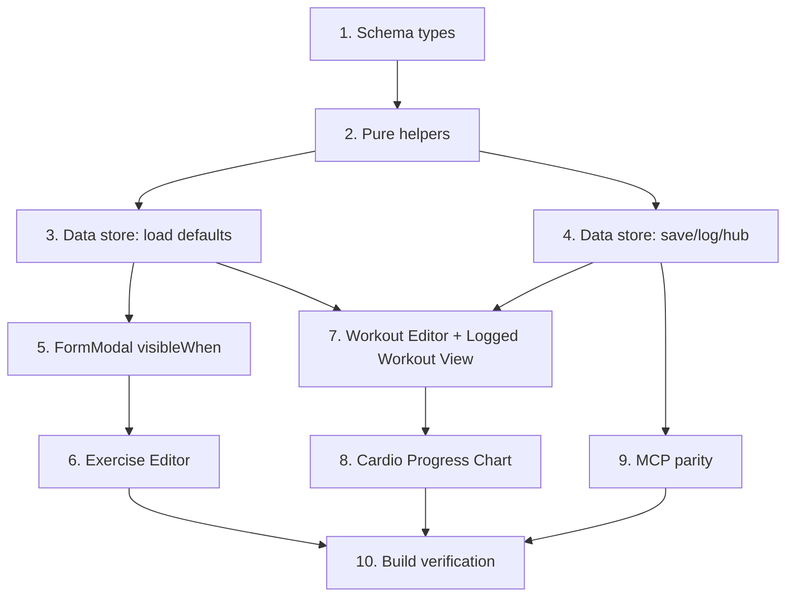

# Implementation Plan

## Overview

Adds an `Exercise Kind`/`Workout Kind` discriminant (strength vs cardio) to the Fitness module, with cardio-specific fields (distance, duration, computed pace), a conditional Exercise Editor, per-row Workout Editor/Logged Workout View rendering, a new Cardio Progress Chart, a monthly total-distance summary, and MCP parity. Purely additive schema extension — no migration. Order: pure helpers + schema first, then data-layer wiring, then the `FormModal` conditional-field extension, then UI wiring (editor/rows/charts), then MCP parity, then build verification.

## Task Dependency Graph



```json
{
  "waves": [
    { "wave": 1, "tasks": ["1"] },
    { "wave": 2, "tasks": ["2"] },
    { "wave": 3, "tasks": ["3", "4"] },
    { "wave": 4, "tasks": ["5", "9"] },
    { "wave": 5, "tasks": ["6", "7"] },
    { "wave": 6, "tasks": ["8"] },
    { "wave": 7, "tasks": ["10"] }
  ]
}
```

## Tasks

- [x] 1. Schema types
  - Add `ExerciseKind`, `WorkoutKind` types to `src/types.ts`; extend `Exercise` with `kind: ExerciseKind`, `targetDistance?: number`, `targetDuration?: number`; extend `WorkoutExercise` with `kind?: ExerciseKind`, `distance?: number`, `duration?: number`; extend `Workout` with `kind: WorkoutKind`.
  - _Requirements: 1.1, 1.6, 2.1, 3.1, 3.2, 3.3, 3.4_

- [x] 2. Pure helpers
  - Add `computePace(distanceKm, durationMin): number | null`, `deriveWorkoutKind(entries): WorkoutKind`, `totalCardioDistance(workouts): number` to `src/data.ts` (exported, no Obsidian imports, colocated near the other Fitness helpers).
  - _Requirements: 2.2, 2.3, 3.1, 3.2, 3.3, 3.4, 3.5, 6.1_

- [x] 3. Data store: load-path defaults (backward compatibility)
  - Add `applyExerciseDefaults(m)` and `applyWorkoutDefaults(m, exercises)`; wire into `loadExercises`/`loadWorkouts` so every returned record always has a valid `kind` (defaulted for legacy files, derived for legacy workouts).
  - _Requirements: 1.2, 3.5, 7.1, 7.2_

- [x] 4. Data store: save/log/hub wiring
  - [x] 4.1 `saveExercise`: write `kind`; write `target_distance`/`target_duration` only when `kind === "cardio"`; keep every existing key unconditionally.
  - [x] 4.2 `logWorkout` / `updateWorkoutExercises`: set frontmatter `kind` via `deriveWorkoutKind(exercises)`.
  - [x] 4.3 `fitnessHubBody`: add a `**Total distance:** N.NN km` line (only when `totalCardioDistance(items) > 0`), wrapped in try/catch that logs and falls back to 0 on failure.
  - _Requirements: 1.4, 1.6, 3.1, 3.2, 3.3, 3.4, 4.5, 4.6, 6.1, 6.2, 6.3, 6.4, 7.3, 7.4_

- [x] 5. FormModal conditional fields
  - Add optional `visibleWhen?: (values) => boolean` to `FieldSpec`; in `FormModal`, track each field's wrapper element, re-evaluate visibility after every field's `onChange`, and toggle display without a full re-render. No behavior change for existing callers that omit `visibleWhen`.
  - _Requirements: 1.3, 1.4, 1.5_

- [x] 6. Exercise Editor
  - `openExerciseModal`: add the `kind` dropdown; make `sets`/`weight` visible only when `kind !== "cardio"`; add `targetDistance`/`targetDuration` fields visible only when `kind === "cardio"`; submit handler persists the right fields per submitted `kind`.
  - _Requirements: 1.3, 1.4, 1.5, 1.6_

- [x] 7. Workout Editor + Logged Workout View
  - [x] 7.1 `renderExerciseRow`: render weight/sets inputs for strength rows, distance/duration inputs + computed read-only pace for cardio rows; header columns adapt to the kinds present in the split's exercises.
  - [x] 7.2 `renderLoggedWorkout`: same per-row field switch for editing already-logged entries.
  - [x] 7.3 `persistRowEdits` / `finishWorkout` / `logWorkoutForDate`: read the right inputs per `ex.kind`; for cardio rows, reject (skip, leave unchanged) entries where distance or duration is not greater than zero, without blocking the rest of the workout.
  - _Requirements: 2.1, 2.4, 4.1, 4.2, 4.3, 4.4, 4.5, 4.6_

- [x] 8. Cardio Progress Chart
  - Add `renderCardioProgress` (sibling to `renderWeightProgress`, same split selector, plots `distance` per cardio Exercise via `drawLineChart`); filter `renderWeightProgress` to strength-only Exercises; wire both into `render()`.
  - _Requirements: 5.1, 5.2, 5.3, 5.4_

- [x] 9. MCP parity (`mcp/src/store.mjs`)
  - Mirror `computePace`/`deriveWorkoutKind`/`totalCardioDistance`, the load-path defaults, `logWorkout`'s `kind` field, and the hub's total-distance line (same position, same 0-omission rule, logged on failure).
  - _Requirements: 8.1, 8.2, 8.3, 8.4_

- [x] 10. Build verification
  - Run `npm run build` (tsc -noEmit + esbuild) and `node --check mcp/src/store.mjs`; fix any type/lint errors surfaced; do not deploy or commit.
  - _Requirements: all_

## Notes

- Purely additive schema extension — no migration step, no `readableNotesSchema` bump needed.
- `WorkoutExercise.kind` absent ⇒ treated as `"strength"` everywhere it matters (legacy data).
- MCP mirroring is a hand-copy (no shared import possible — `.mjs` has no build step), per design.md Dependencies.
- Correctness properties P1–P8 in design.md describe the intended behavior of the pure helpers and data-store methods; no automated property-based tests are added in this pass (out of scope per user's "buildar local pra eu testar" ask) — manual testing in the dev vault is the verification path for this iteration.
