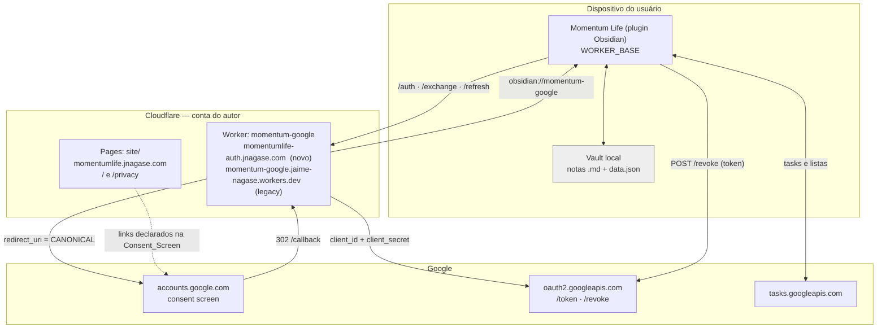
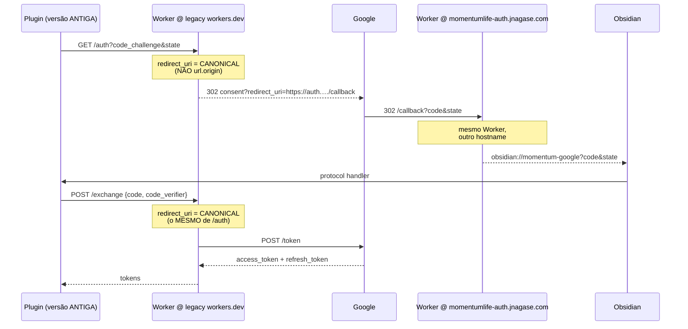
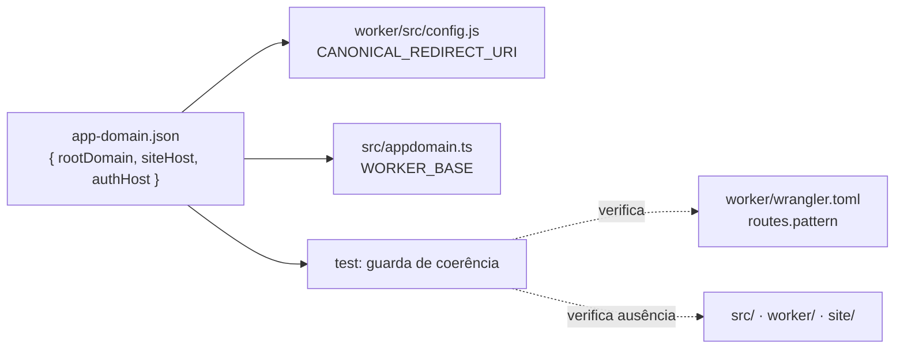
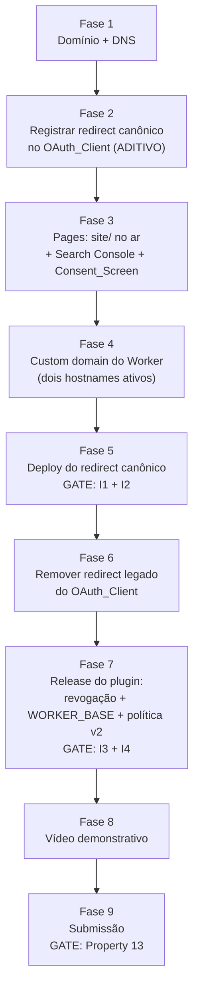

# Design Document

## Overview

Esta spec entrega o conjunto de artefatos e mudanças necessários para submeter o app
`obsidian-tasks-499613` à verificação OAuth do Google, mantendo **todas** as instalações
existentes do Momentum Life funcionando sem nenhuma ação do usuário.

O coração técnico do design é uma mudança de **quatro linhas** no OAuth_Broker: substituir
`const redirectUri = url.origin + "/callback"` por uma constante canônica. Isso desacopla o
`redirect_uri` que o Google vê do host pelo qual a requisição chegou, e é o que permite:

- registrar **um único** authorized redirect URI no OAuth_Client, sob o App_Domain;
- **remover** o redirect URI em `workers.dev` — eliminando o conflito do Requirement 1,
  critério 7 (sufixo público compartilhado não pode entrar em "Authorized domains");
- continuar atendendo os plugins antigos no Legacy_Origin, porque eles nunca escolheram o
  `redirect_uri` — quem escolhe é o Broker.

O resto do trabalho é composição de artefatos: um domínio próprio verificado, duas páginas
estáticas (homepage e política de privacidade) versionadas no repositório, a consent screen
alinhada caractere a caractere com essas páginas, revogação real de token no comando de
desconectar do plugin, e três documentos de submissão (justificativa de escopo, roteiro do
vídeo, checklist).

Duas restrições atravessam tudo:

1. **Nenhum usuário perde a conexão.** Nenhum passo desta spec invalida um refresh token
   existente. As duas operações que invalidariam — criar um OAuth_Client novo e alterar o
   conjunto de escopos — estão explicitamente proibidas no design.
2. **Nenhuma declaração pública é mais generosa que o código.** A política de privacidade é
   publicada em duas versões: a v1 descreve o comportamento atual, a v2 é publicada no
   **mesmo commit** do release que implementa a revogação. Por isso o site vive no repositório
   do plugin.

### Escopo de código desta spec

| Artefato | Muda? |
| --- | --- |
| `worker/src/index.js` | Sim — redirect canônico, validação de parâmetros, passthrough de erro, timeout |
| `worker/wrangler.toml` | Sim — rota de custom domain, `workers_dev` explícito |
| `app-domain.json` (novo, raiz) | Sim — fonte de verdade do App_Domain |
| `src/googletasks.ts` | Sim — `WORKER_BASE` derivado, `revokeGoogleToken()`, remoção da chamada a `userinfo` |
| `src/main.ts` | Sim — fluxo de desconexão com confirmação e revogação, log redigido |
| `src/whatsnew.ts` | Sim — entrada de CHANGELOG informando que nada precisa ser feito |
| `site/` (novo) | Sim — homepage, política, `robots.txt`, `_headers` |
| `docs/oauth-verification/` (novo) | Sim — justificativa de escopo, roteiro do vídeo, checklist |
| `README.md` | Sim — link da política, seção do aviso de app não verificado |
| `src/gtSync.ts` | **Não** — o motor de sync não é tocado |

---

## Decisões

Registradas aqui como premissas do design. **Único valor a confirmar: o nome do domínio.**
Todo o resto está fechado.

| # | Decisão | Rationale |
| --- | --- | --- |
| D1 | **Domínio raiz: `jnagase.com`, já registrado pelo autor.** Nada a comprar. **Nenhum valor pendente.** | Domínio próprio já existente, fora de sufixo público compartilhado. Verificação por TXT no Search Console cobre todos os subdomínios de uma vez. |
| D2 | **Páginas em Cloudflare Pages, conteúdo versionado em `site/` no repo do plugin.** | Requirement 3, critério 15 exige que a política acompanhe o código. Mesmo repo = mesmo commit = mesma publicação. |
| D3 | **Topologia:** homepage em `https://momentumlife.jnagase.com/`, política em `https://momentumlife.jnagase.com/privacy`, Broker em `https://momentumlife-auth.jnagase.com`. `Canonical_Redirect_Uri = https://momentumlife-auth.jnagase.com/callback`. **"Authorized domains" recebe só `jnagase.com`** (domínio raiz registrável). | Separa conteúdo estático (Pages) de código (Worker) sem roteamento condicional. Interpretação adotada do Requirement 6, critério 1: "sob App_Domain" inclui subdomínio — o que o Google valida é o domínio raiz registrável, que é o mesmo para os dois hosts. |
| D3b | **Os dois hosts são subdomínios de PRIMEIRO nível de `jnagase.com`.** Broker é `momentumlife-auth.jnagase.com`, **não** `auth.momentumlife.jnagase.com`. | O Universal SSL da Cloudflare cobre apenas o apex e **um** nível de subdomínio (`*.jnagase.com`). Um host de segundo nível como `auth.momentumlife.jnagase.com` **não** receberia certificado automático — exigiria Advanced Certificate Manager (pago) ou Total TLS, e um certificado ausente reprova o Requirement 1, critério 2. Usar hífen em vez de ponto elimina o problema sem custo. |
| D4 | **Sem logo na primeira submissão.** | Logo dispara brand review, que corre em paralelo e pode concluir depois. Item opcional pós-aprovação (Requirement 5, critério 4 é `WHERE`, condicional). |
| D5 | **Revogação no desconectar entra nesta spec.** | Requirement 3, critério 9 exige que a política declare que desconectar encerra o acesso. Hoje o botão só faz `googleToken = null`. Sem a revogação, a política mentiria. |
| D6 | **Nome do app na Consent_Screen: `Momentum Life`** (caixa exata, com espaço). | A regra de lint `obsidianmd/ui/sentence-case` vale para UI do plugin, não para texto do Google. O nome tem que casar caractere a caractere com o `<h1>` da homepage (Requirement 2, critério 2). |
| D7 | **Conta Google de teste separada para o vídeo**, consumindo 1 vaga do cap de 100. | Requirement 9, critério 8 proíbe dado pessoal real em quadro. Registrar o consumo da vaga no checklist. |
| D8 | **Legacy_Origin sai do OAuth_Client**, resolvido pelo redirect canônico (ver "Modelo do redirect canônico"). | Elimina o conflito do Requirement 1, critério 7 sem quebrar instalação antiga. Passa a valer o critério 11 do Requirement 7: canonical como único redirect URI registrado. |
| D9 | **`app-domain.json` na raiz é a fonte de verdade do domínio.** | Trocar o domínio = editar uma linha de código + uma linha de rota. Ver "Fonte única do domínio" para o inventário completo das ocorrências. |
| D10 | **Nenhum escopo novo. A chamada a `oauth2/v3/userinfo` é removida.** | O escopo pedido é só `.../auth/tasks`, que não autoriza `userinfo` — a chamada de hoje falha com 401 e `fetchEmail` devolve `""` (a UI já cai no fallback "Google user", então remover não muda nada visível). Manter uma chamada condenada a falhar contradiz a declaração "o app só acessa tasks e listas de tasks" (Requirement 3, critérios 3 e 7). Reversível adicionando `openid email` aos escopos — o que aumentaria a superfície do consent e o custo do review. |
| D11 | **Política publicada em duas versões: v1 antes do release, v2 no commit do release.** | Mantém fidelidade em todo momento: a v1 diz que desconectar remove o token local e aponta a página de permissões do Google; a v2 diz que desconectar revoga. |
| D12 | **O OAuth_Client `8btbj3o6…` é reutilizado. Criar client novo está proibido.** | Client novo invalida todo refresh token existente — quebra silenciosa de todos os usuários conectados. Mesma regra para o conjunto de escopos: imutável nesta spec. |

---

## Architecture

### Domínio e hospedagem



Pontos que o diagrama fixa:

- **Nenhum dado de task passa pelo Cloudflare.** O plugin fala direto com
  `tasks.googleapis.com`. O Worker só participa do handshake OAuth, porque só ele tem o
  `client_secret`.
- **A revogação sai do dispositivo**, direto para `oauth2.googleapis.com/revoke`. Esse
  endpoint não exige autenticação de client, então não precisa passar pelo Broker — e passar
  pelo Broker contradiria a declaração da política de que o Broker só faz troca e renovação
  de token.
- **O Worker responde em dois hostnames.** Mesmo código, mesmo deploy, mesmo comportamento.

### Modelo do redirect canônico

Este é o ponto central do design. O código atual deriva o callback do host de entrada:

```js
const redirectUri = url.origin + "/callback";   // ← hoje
```

Isso amarra o `redirect_uri` que o Google vê ao hostname que o plugin instalado conhece.
Como as versões já publicadas do plugin têm `momentum-google.jaime-nagase.workers.dev`
compilado dentro do `main.js`, o Google precisa ter esse callback registrado — e
`workers.dev` é sufixo público compartilhado, que o Google **recusa** em "Authorized
domains". Daí o impasse do Requirement 1, critério 7.

A troca:

```js
const CANONICAL_REDIRECT_URI = `https://${AUTH_HOST}/callback`;   // ← constante, sempre
```

Depois disso, **o plugin não influencia mais o `redirect_uri`**. Qualquer versão, chamando
qualquer hostname, produz o mesmo fluxo:



Por que preserva compatibilidade, item por item:

| Elemento | Depende do hostname? | Consequência |
| --- | --- | --- |
| `code_challenge` / `code_verifier` (PKCE) | Não. O verifier fica no plugin, o Worker é stateless. | Nada muda. |
| `state` | Não. Gerado e validado no plugin; o Worker repassa sem tocar. | Nada muda. |
| Deep link `obsidian://momentum-google` | Não. O handler não olha de onde veio. | Funciona igual, mesmo servido por outro hostname. |
| `/exchange` | **Sim, criticamente.** | O Google exige que o `redirect_uri` do `/token` seja **idêntico** ao do `/auth`. Se `/auth` usar a constante e `/exchange` usar `url.origin`, o Google recusa com `redirect_uri_mismatch`. As duas linhas mudam juntas ou nada funciona. |
| `/refresh` | Não. `grant_type=refresh_token` não leva `redirect_uri`. | Refresh tokens antigos continuam válidos. Nenhuma reautorização. |
| Registro no OAuth_Client | Passa a precisar só do canonical. | O redirect de `workers.dev` deixa de ser exercido e pode ser removido. |

O que isso resolve nos requisitos: o critério 7 do Requirement 1 (a exceção) deixa de ser
necessário, porque nenhuma URL registrada no OAuth_Client pertence a sufixo público. Vale o
critério 11 do Requirement 7: o Canonical_Redirect_Uri é o **único** authorized redirect URI.
"Authorized domains" fica com **uma** entrada: `jnagase.com`.

O Legacy_Origin continua servindo `/auth`, `/exchange` e `/refresh` indefinidamente — só o
`/callback` deixa de ser exercido nesse hostname (o Google nunca mais redireciona para lá).

### Fonte única do domínio

`app-domain.json` na raiz do repositório é a fonte de verdade. Consumidores:



Inventário honesto das ocorrências do domínio:

| Onde | Ocorrências | Como fica sincronizado |
| --- | --- | --- |
| `app-domain.json` | 1 (a fonte) | — |
| `worker/wrangler.toml` → `routes[].pattern` | 1 | TOML não importa JSON. Guarda de teste falha se divergir de `app-domain.json`. |
| `site/*.html` | **0** | As páginas usam **apenas caminhos relativos** (`/`, `/privacy`). Requisito de link "sob App_Domain" é satisfeito pela resolução relativa. |
| `src/`, `worker/src/` | **0** literais | Derivam da fonte por import. Guarda de teste faz grep e falha se aparecer literal. |
| Cloudflare (Pages custom domain, Worker custom domain) | 2, fora do repo | Passos manuais no checklist. |
| Google Cloud (redirect URI, homepage, privacy, authorized domain) | 4, fora do repo | Passos manuais no checklist. |

Trocar o domínio = editar `app-domain.json` (1 linha) + `worker/wrangler.toml` (1 linha) +
reexecutar os passos de plataforma do checklist. Nenhuma varredura de código.

O plugin importa JSON, o que exige `"resolveJsonModule": true` no `tsconfig.json` (uma linha).
O esbuild já embute JSON nativamente; o wrangler também.

---

## Components and Interfaces

### C1 — `app-domain.json` (novo, raiz do repo)

```json
{
  "rootDomain": "jnagase.com",
  "siteHost": "momentumlife.jnagase.com",
  "authHost": "momentumlife-auth.jnagase.com"
}
```

Três campos, e não um domínio + prefixos, porque o site e o Broker vivem em **subdomínios
irmãos** de um domínio raiz que hospeda outras coisas do autor. `rootDomain` existe separado
porque é o valor que vai em "Authorized domains" e no Search Console — o Google valida o domínio
raiz registrável, não os hosts.

Derivações:

| Constante | Valor derivado | Onde vive |
| --- | --- | --- |
| `ROOT_DOMAIN` | `jnagase.com` | documentação/checklist (Authorized domains, Search Console) |
| `SITE_HOST` | `momentumlife.jnagase.com` | documentação/checklist |
| `AUTH_HOST` | `momentumlife-auth.jnagase.com` | ambos |
| `CANONICAL_REDIRECT_URI` | `https://momentumlife-auth.jnagase.com/callback` | `worker/src/config.js` |
| `WORKER_BASE` | `https://momentumlife-auth.jnagase.com` | `src/appdomain.ts` |
| `APP_HOMEPAGE` | `https://momentumlife.jnagase.com/` | documentação/checklist |
| `PRIVACY_URL` | `https://momentumlife.jnagase.com/privacy` | documentação/checklist |

Invariante que a Property 11 verifica: o domínio raiz registrável extraído de `SITE_HOST` e de
`AUTH_HOST` é o mesmo e igual a `ROOT_DOMAIN`; e ambos são subdomínios de **primeiro nível**
(exatamente um label antes de `rootDomain`), o que mantém a cobertura do Universal SSL (D3b).

`CANONICAL_REDIRECT_URI` e `WORKER_BASE` são derivados por template da **mesma** fonte, o
que torna impossível o par divergir (a causa clássica de `redirect_uri_mismatch`).

### C2 — `site/` (novo)

```
site/
├─ index.html          → https://<SITE_HOST>/          (App_Homepage)
├─ privacy.html        → https://<SITE_HOST>/privacy   (Privacy_Policy_Page)
├─ styles.css          CSS puro, sem framework, sem fonte remota
├─ robots.txt          Allow total; sem regra para / nem /privacy
└─ _headers            garante ausência de X-Robots-Tag: noindex
```

Regras de construção, cada uma amarrada a um critério:

- **Zero JavaScript.** Nenhuma tag `<script>`, nenhum atributo de evento inline, nenhum
  recurso remoto. Satisfaz Requirement 2 critério 6 e Requirement 3 critério 1 por
  construção, não por teste de runtime.
- **Todo o conteúdo em inglês** (Requirement 2 critério 8, Requirement 3 critério 14).
- **Links internos relativos** (`href="/privacy"`, `href="/"`); o único link absoluto é o do
  repositório GitHub.
- **Sem redirecionamento.** A URL registrada na Consent_Screen tem que responder `200`
  direto. O Cloudflare Pages faz clean URLs (`privacy.html` servido em `/privacy`), mas o
  comportamento de barra final varia: o checklist exige verificar com `curl -sSI` que
  `https://<SITE_HOST>/privacy` devolve `200` e não `301`, e registrar exatamente a URL que
  respondeu 200 como a URL canônica declarada.
- **Sem `noindex`.** Deployments de *preview* do Pages recebem `X-Robots-Tag: noindex` por
  padrão. Só o deployment de **produção com custom domain** é usado como URL declarada;
  nenhuma URL `*.pages.dev` entra em lugar algum.
- **`www` não é usado.** Não é declarado na Consent_Screen nem linkado. Um redirect
  301 `www` → apex é opcional e irrelevante para o review.

#### `site/index.html` — estrutura

| Seção | Conteúdo | Critério |
| --- | --- | --- |
| `<h1>` | `Momentum Life` — caractere a caractere igual ao nome na Consent_Screen | 2.2 |
| Subtítulo | "An Obsidian plugin for tasks, habits, fitness, nutrition and studies." | 2.4 |
| "Google Tasks sync" | Sync **bidirecional** entre notas do vault e listas do Google Tasks; **opcional e desligada por padrão**, ligada pelo próprio usuário | 2.4 |
| "What the app accesses" | Lista: **your task lists** (para espelhar boards) e **your tasks** (para espelhar notas de task), com a finalidade de cada acesso; e a frase de que nada mais é acessado | 2.4 |
| "Author and contact" | `Jaime Nagase` + email de contato **idêntico** ao developer contact da Consent_Screen | 2.3 |
| Links | `/privacy` e `github.com/jnagase/obsidian-momentum`, ambos em texto, alcançáveis só com rolagem | 2.5 |

#### `site/privacy.html` — estrutura

Cada seção existe para cobrir um critério do Requirement 3. Mapeamento:

| Seção | Declaração | Critério |
| --- | --- | --- |
| Where your data lives | Dados de task gravados **apenas** em arquivos markdown no vault local do usuário | 3.2 |
| Who talks to Google | Chamadas à Google Tasks API partem do dispositivo direto para `tasks.googleapis.com`, sem servidor do autor | 3.3 |
| The OAuth broker | Participa **exclusivamente** do handshake (troca de code por tokens e renovação); não recebe, não processa e não armazena conteúdo de tasks | 3.4 |
| The OAuth broker | Não persiste tokens, authorization codes nem identificadores de usuário | 3.5 |
| Tokens | Armazenados **só** no `data.json` local; permanecem até o usuário desconectar ou remover o arquivo; sem retenção em sistema do autor | 3.6 |
| Data we read and write | Lista **exaustiva**: title, notes, due date, completion status, task id, task list id — e nada além disso | 3.7 |
| How the data is used | Só para o sync pedido pelo usuário; não vendido, não transferido a terceiros, não usado para publicidade, não usado para treinar IA | 3.8 |
| Revoking access | Dois caminhos (comando no plugin · página de permissões da conta Google); para cada um: token local removido, plugin para de acessar a API, notas de task preservadas | 3.9 |
| Deleting your data | Remover o `data.json` apaga os tokens; remover as notas do vault apaga o conteúdo sincronizado | 3.10 |
| No telemetry | Nenhuma telemetria, nenhum analytics sobre o uso do sync | 3.12 |
| Rodapé | `Last updated: YYYY-MM-DD` + email de privacidade idêntico ao developer contact | 3.11 |

**Versionamento da política (D11):**

- **v1** (publicada antes do release): em "Revoking access", o caminho do plugin diz que
  desconectar **remove o token local e para o acesso**, e aponta a página de permissões do
  Google para revogar a concessão. Fiel ao código de hoje.
- **v2** (mesmo commit do release): o caminho do plugin diz que desconectar **revoga o acesso
  do app** e remove o token local. `Last updated` passa para a data do release.

A integração Git do Pages (production branch `main`, output directory `site`, sem build
command) garante que política e código sobem no mesmo push. Requirement 3 critério 15 é
satisfeito por acoplamento de deploy, não por disciplina manual.

### C3 — OAuth_Broker (`worker/src/index.js`, `worker/src/config.js`)

Contrato dos endpoints — inalterado na forma, endurecido no comportamento:

| Endpoint | Método | Entrada | Saída |
| --- | --- | --- | --- |
| `/auth` | GET | `code_challenge`, `state` (obrigatórios) | `302` para o consent do Google com `redirect_uri=CANONICAL` |
| `/callback` | GET | `code`+`state`, ou `error`+`error_description` | HTML que redireciona para `obsidian://momentum-google` em ≤2 s, com link manual |
| `/exchange` | POST | `{ code, code_verifier }` (obrigatórios) | Corpo do Google, status do Google |
| `/refresh` | POST | `{ refresh_token }` (obrigatório) | Corpo do Google, status do Google |

Mudanças:

1. **Redirect canônico.** `worker/src/config.js` exporta `CANONICAL_REDIRECT_URI` derivado de
   `app-domain.json`. `url.origin` sai de cena; `/auth` e `/exchange` passam a usar a
   constante. Nenhuma outra linha do fluxo depende do host.
2. **Validação de parâmetros obrigatórios** (Requirement 6 critério 9). Hoje `/auth` aceita
   ausência com `|| ""` e manda para o Google, que devolve um erro genérico. Passa a
   responder `400` nomeando o parâmetro ausente, **sem chamar o Google**. `/exchange` e
   `/refresh` já validam; a mensagem passa a nomear o parâmetro.
3. **Timeout de 10 s** nas chamadas a `oauth2.googleapis.com/token` (Requirement 6 critério
   11), via `AbortSignal.timeout(10_000)`. Sem retentativa. Resposta `504` com corpo
   `{ error: "timeout", error_description: "..." }`.
4. **Passthrough de erro** (Requirement 6 critério 8). Já é o comportamento — o corpo do
   Google volta cru com o status do Google. Fica registrado como invariante a proteger: **não
   envolver, não reescrever, não substituir por mensagem genérica.** O `googleError()` do
   plugin depende de `error`/`error_description` chegarem intactos.
5. **Callback com erro** (Requirement 6 critério 10). Hoje o deep link já carrega `error`.
   Passa a carregar também `error_description`, e a página deixa de dizer "✓ Authorised"
   quando há erro.
6. **Secrets só do env** (Requirement 6 critério 7). `client_id`/`client_secret` vindos da
   query são ignorados; nenhum valor de secret entra em resposta, redirect, deep link ou HTML.

`worker/wrangler.toml`:

```toml
name = "momentum-google"
main = "src/index.js"
compatibility_date = "2024-11-01"

workers_dev = true            # ← EXPLÍCITO. Desligar isto quebra TODA instalação antiga.

[[routes]]
pattern = "momentumlife-auth.jnagase.com"
custom_domain = true
```

`workers_dev = true` é a linha mais perigosa do arquivo. Adicionar uma rota de custom domain
não desliga o subdomínio `workers.dev` por si, mas a flag torna a intenção explícita e
protege contra uma limpeza futura de configuração. Se cair para `false`, todo plugin já
instalado perde `/auth`, `/exchange` e `/refresh` de uma vez.

### C4 — Plugin: revogação e desconexão

Novo em `src/googletasks.ts`:

```ts
export type RevokeOutcome =
  | { ok: true }
  | { ok: false; reason: "google_error" | "network" | "timeout"; detail: string };

/** Uma tentativa, sem retry, limite de 10 s. Não toca o token armazenado. */
export async function revokeGoogleToken(token: GoogleToken): Promise<RevokeOutcome>;
```

- Endpoint: `POST https://oauth2.googleapis.com/revoke`, corpo
  `application/x-www-form-urlencoded` com `token=<refresh_token ?? access_token>`. Revogar o
  refresh token invalida também os access tokens derivados dele.
- `requestUrl` com `throw: false` (o default do Obsidian lança em 4xx e transformaria as
  guardas de status em código morto — a lição já registrada no steering).
- O limite de 10 s vem de um `Promise.race` com `window.setTimeout`, porque `requestUrl` não
  expõe timeout. Perder a corrida devolve `{ ok: false, reason: "timeout" }`; a requisição
  órfã é ignorada.
- `detail` vem de `googleError()`, que extrai `error`/`error_description`. Nunca contém o
  token: o corpo de erro do Google é `{"error":"invalid_token"}`, sem eco do valor.

Novo em `src/main.ts`:

```ts
async disconnectGoogleTasks(): Promise<void>;
```

Sequência:

1. **`ConfirmModal`** com texto em inglês, sentence case:
   `"Disconnect Google tasks? The app's access to your Google account will be revoked. Your task notes in the vault are kept."`
2. **Cancelar** → retorna. Token inalterado, nenhuma requisição enviada (Requirement 4
   critério 5).
3. **Confirmar** → `revokeGoogleToken(token)`.
4. **Sempre** (sucesso ou falha): `googleToken = null`, `saveSettings()`, reagenda o intervalo
   de sync (o timer para de existir em vez de rodar e cair na guarda), rerender das settings.
5. Notice conforme o resultado:
   - `ok` → `"✓ Google tasks: access revoked and disconnected."`
   - `!ok` → `"Google tasks: disconnected locally, but revocation wasn't confirmed. You can also remove access at myaccount.google.com/permissions."`
6. Log em `Config/google-auth-debug.md` com etapa `revoke`, timestamp e `detail` — passando
   pelo redator (C5).

O que **não** é tocado (Requirement 4 critério 3): nenhuma nota do vault, nenhum frontmatter,
nenhum `google_id`/`google_list`, nenhuma task ou lista na conta Google. Também **não** são
apagados os `gtBaselines` do `data.json` — preservá-los deixa uma reconexão futura retomar o
merge 3-way em vez de tratar tudo como primeiro contato.

O botão de UI muda apenas de handler: `"Disconnect"` passa a chamar
`plugin.disconnectGoogleTasks()` em vez de zerar o token inline.

### C5 — Plugin: redação de segredos e log de auth

Um único ponto de escrita para o log de auth, com redator obrigatório:

```ts
/** Substitui qualquer ocorrência de segredo conhecido por "<redacted>" antes de gravar. */
function redactSecrets(line: string, token: GoogleToken | null): string;
```

Aplicado a **toda** linha antes de entrar no buffer do `Config/google-auth-debug.md`. Cobre
access token, refresh token e authorization code. Requirements 4 critério 4 e 11 critério 6
deixam de depender de vigilância manual em cada `log(...)` e passam a ser uma invariante
testável (Property 9).

Formato da entrada de log (Requirement 11 critérios 4 e 5):

```
- 2026-03-14T12:31:07.512Z · stage=exchange · error=invalid_grant · error_description=Bad Request
- 2026-03-14T12:31:07.512Z · stage=refresh · unparseable body (first 500 chars): <html>…
```

`stage` ∈ `authorize | exchange | refresh | revoke`. Corpo sem `error`/`error_description`, ou
não interpretável, vira a segunda forma, truncada em 500 caracteres.

### C6 — Plugin: `WORKER_BASE` e remoção da chamada a `userinfo`

- `src/appdomain.ts` (novo) exporta `WORKER_BASE` derivado de `app-domain.json`.
  `src/googletasks.ts` importa em vez de declarar o literal. **Sem fallback para o
  Legacy_Origin** (Requirement 7 critério 5): o legacy segue no ar para quem não atualizou,
  mas nenhuma versão nova volta a ele.
- `fetchEmail()` e sua chamada saem (D10). `GoogleToken.email` continua no tipo como opcional
  e simplesmente não é populado; a UI já exibe `"Connected as Google user"` nesse caso. O
  campo é preservado no tipo para não invalidar `data.json` de instalações existentes.
- `src/whatsnew.ts` ganha entrada informando, em uma linha, que a conexão com o Google
  continua ativa e que **nenhuma ação é necessária** (Requirement 7 critério 8).

### C7 — Configuração do Google Cloud (`obsidian-tasks-499613`)

Tudo no client existente. **Criar client novo está proibido** (D12).

| Item | Valor |
| --- | --- |
| OAuth_Client | Web, id `8btbj3o6…` — o mesmo, sempre |
| Authorized redirect URIs | Fase 2: adiciona `https://momentumlife-auth.jnagase.com/callback`. Fase 6: remove o de `workers.dev`. Estado final: **um só** |
| Authorized JavaScript origins | vazio (não há navegador chamando o Broker por XHR) |
| App name | `Momentum Life` |
| User support email | conta do autor |
| Developer contact email | **idêntico** ao email publicado nas duas páginas |
| Application home page | `https://momentumlife.jnagase.com/` |
| Application privacy policy link | a URL exata que respondeu `200` sem redirect |
| Terms of service | vazio (não exigido pelos critérios) |
| Authorized domains | `jnagase.com` — **uma entrada**, domínio raiz registrável, sem esquema, sem `www`, **sem os subdomínios**, sem caminho, sem barra. Cobre `momentumlife.` e `momentumlife-auth.` de uma vez |
| Logo | não enviado (D4) |
| Scopes | `https://www.googleapis.com/auth/tasks` — único sensível, nenhum restrito. **Imutável nesta spec** |
| User type / Publishing status | `External` / `In production` — nunca voltar para `Testing` |

Duas armadilhas de dados de usuário, ambas com consequência silenciosa:

- **Client novo** → todo refresh token existente morre.
- **`Testing`** → o Google revoga refresh tokens a cada 7 dias. É exatamente o sintoma que já
  motivou a mensagem de `GoogleAuthExpiredError` no código.

Search Console: propriedade **de domínio** (TXT no DNS), na conta Google que tem papel
**Owner** no projeto — Editor ou Viewer não bastam (Requirement 1 critério 3). A propriedade
de domínio cobre `auth.` sem registro extra. O registro TXT fica publicado enquanto a
submissão estiver pendente (critério 8).

### C8 — Artefatos de submissão (`docs/oauth-verification/`)

```
docs/oauth-verification/
├─ scope-justification.md    texto em inglês, ≤ 4.000 caracteres
├─ demo-video-script.md      roteiro de gravação, tomada por tomada
└─ submission-checklist.md   Submission_Checklist
```

#### `scope-justification.md`

Cinco blocos, um por critério do Requirement 8:

1. **Scope and feature.** String exata `https://www.googleapis.com/auth/tasks`; sync
   bidirecional de tasks entre o vault e o Google Tasks como **única** funcionalidade
   dependente; nenhum outro escopo sensível ou restrito (8.1).
2. **Why read-only is not enough.** As quatro escritas — create task, update task, mark task
   completed, delete task — e a afirmação de que `.../auth/tasks.readonly` não permite
   nenhuma das quatro (8.2).
3. **Where the data goes.** Markdown no vault local; o autor não opera servidor de
   armazenamento; o Broker só faz handshake, sem receber, processar ou persistir conteúdo de
   task, token ou identificador (8.3).
4. **Limited Use.** As quatro restrições, explícitas: não vendido, não transferido a
   terceiros, não usado para publicidade, não usado para treinar IA; usado somente para o
   sync pedido pelo usuário (8.4).
5. **Consistency.** Mesmas afirmações de armazenamento, compartilhamento e retenção da
   política de privacidade, no mesmo nível de detalhe (8.6).

O arquivo é a fonte; o campo do Verification Center recebe uma cópia **idêntica** (8.7). O
checklist guarda o hash do arquivo submetido.

#### `demo-video-script.md`

Quatro tomadas contínuas. "Contínua" significa sem corte **dentro** da tomada; cortes entre
tomadas são permitidos, exceto entre o consentimento e o retorno ao Obsidian (Requirement 9
critério 5), que ficam na mesma tomada.

| Tomada | Conteúdo | Critérios |
| --- | --- | --- |
| 1 — Setup e consent | Settings do Momentum Life com o nome do plugin visível → clique em "Connect Google account" → consent screen com `Momentum Life` e a permissão do escopo → **barra de endereço expandida** mostrando `client_id=8btbj3o6…` e `redirect_uri=https%3A%2F%2Fmomentumlife-auth.jnagase.com%2Fcallback` → aprovação → deep link `obsidian://momentum-google` → confirmação nas settings. **Sem corte do clique até a confirmação.** | 9.2, 9.3, 9.4, 9.5 |
| 2 — Obsidian → Google | Criar uma task fictícia no board → acionar "Sync now" → abrir o Google Tasks e mostrar a mesma task, com a lista correspondente visível | 9.6 |
| 3 — Google → Obsidian | Criar uma task no Google Tasks → acionar "Sync now" → mostrar a nota no board correspondente | 9.6 |
| 4 — Encerramento | Restabelecer o contexto: plugin, escopo e finalidade | 9.7 |

Restrições de gravação: conta Google de teste (D7); títulos fictícios; nenhuma outra aba,
notificação do sistema ou nota do vault com dado real em quadro (9.8); 2 a 10 minutos;
mínimo 1280×720 com o texto dos critérios 3, 4 e 6 legível em pausa (9.9); narração ou
legenda **própria** em inglês, sem legenda automática do YouTube (9.7); YouTube público ou
unlisted, mesma URL até a decisão final (9.1).

O clique em "Connect" da tomada 1 consome 1 vaga do cap de 100 — registrar (9.10).

#### `submission-checklist.md`

Uma linha por critério de aceitação dos Requirements 1 a 9, com estado único:

```markdown
| ID | Critério (resumo) | Estado | Evidência | Última mudança |
| --- | --- | --- | --- | --- |
| 1.1 | App_Domain registrado, expiração ≥ 90 d | concluído | print do WHOIS/RDAP | 2026-03-02 |
| 1.2 | HTTPS em apex e auth., cert válido | em andamento | saída de `curl -sSI` | 2026-03-02 |
```

Estados: `não iniciado` · `em andamento` · `concluído` · `bloqueado` — exatamente um por
linha. Seções adicionais no mesmo arquivo, exigidas pelos Requirements 1, 5, 9 e 10:

- **Gate de submissão** — a lista de itens que não estão `concluído`. Vazia é a única
  condição que libera o envio (10.2, 10.8).
- **Registro de verificação de domínio** — tentativas, método, erro, troca de método
  (1.6, 1.9).
- **Contador de vagas** — contas que já autorizaram e vagas restantes do cap vitalício de
  100, atualizado a cada envio e a cada resposta ao Google (5.8, 9.10, 10.9).
- **Diário do review** — pedidos do Google (texto integral, prazo), respostas enviadas,
  recusas e o critério afetado (10.3, 10.4).
- **Exceções e desvios** — hoje: nenhuma. A exceção do Requirement 1 critério 7 fica
  registrada como **resolvida por design**, com a Fase 5 como evidência.

---

## Data Models

### `app-domain.json`

```ts
interface AppDomainConfig {
  rootDomain: string;   // domínio raiz registrável — vai em "Authorized domains"
  siteHost: string;     // host das páginas (homepage + política)
  authHost: string;     // host do OAuth_Broker
}
```

Invariantes:

- os três casam `^[a-z0-9-]+(\.[a-z0-9-]+)+$`, minúsculos, sem esquema, sem `/`, sem `:`, sem
  espaço e sem barra final;
- `siteHost` e `authHost` terminam em `.${rootDomain}`;
- ambos têm **exatamente um** label antes de `rootDomain` — subdomínio de primeiro nível, para
  ficar dentro da cobertura do Universal SSL (D3b). Um host de segundo nível é rejeitado pela
  validação em vez de virar erro de TLS em produção;
- `siteHost !== authHost`;
- `rootDomain` não pertence a sufixo público compartilhado.

Toda URL do sistema é derivada por template — nunca por concatenação ad hoc no ponto de uso.

### `GoogleToken` (existente, `src/googletasks.ts`)

```ts
interface GoogleToken {
  access_token: string;
  refresh_token: string;
  expires_at: number;   // epoch ms, já com a margem de 60 s
  email?: string;       // deixa de ser populado (D10); mantido para não invalidar data.json
}
```

Persistido em `data.json` sob `googleToken`. Estado desconectado é `null` — não objeto vazio,
não string vazia. As guardas espalhadas pelo código (`!this.settings.googleToken`) dependem
disso.

### `RevokeOutcome` (novo)

```ts
type RevokeOutcome =
  | { ok: true }
  | { ok: false; reason: "google_error" | "network" | "timeout"; detail: string };
```

`detail` é texto já redigido, seguro para log. A distinção entre `reason` existe para o log e
para a mensagem ao usuário; **nenhum** valor de `reason` altera o desfecho do token local,
que é sempre removido (Requirement 4 critérios 2 e 6).

### Entrada do Submission_Checklist

```ts
interface ChecklistItem {
  id: string;                 // "1.1" … "9.11"
  summary: string;
  state: "não iniciado" | "em andamento" | "concluído" | "bloqueado";
  evidence: string;           // URL ou caminho de artefato
  lastChanged: string;        // YYYY-MM-DD
}
```

Derivado, não armazenado: `blockingItems = items.filter(i => i.state !== "concluído")`, e
`canSubmit = blockingItems.length === 0`.

### Entrada do log de auth

```ts
interface AuthLogEntry {
  at: string;                                                   // ISO 8601
  stage: "authorize" | "exchange" | "refresh" | "revoke";
  error?: string;                                               // do Google
  errorDescription?: string;                                    // do Google
  rawTruncated?: string;                                        // ≤ 500 chars, quando não interpretável
}
```

Invariante do modelo: nenhum campo contém access token, refresh token, authorization code ou
client secret. Garantida por construção pelo redator (C5), não por revisão de cada chamada.

### Modelo de requisição do Broker (conceitual)

```ts
interface BrokerRequest {
  host: string;                     // legacy OU AUTH_HOST — NÃO influencia a saída
  path: "/auth" | "/callback" | "/exchange" | "/refresh";
  params: Record<string, string>;
}
```

Invariante central do design: para toda `BrokerRequest`, a saída observável é função de
`path` e `params` — **`host` não participa**. É o que sustenta simultaneamente a canonicidade
do redirect e a compatibilidade com o Legacy_Origin, e é a Property 1 e a Property 2.

---

## Correctness Properties

*Uma propriedade é uma característica ou comportamento que deve ser verdadeiro em todas as
execuções válidas do sistema — uma afirmação formal sobre o que o sistema deve fazer. As
propriedades são a ponte entre a especificação legível por humanos e garantias de correção
verificáveis por máquina.*

Boa parte desta spec é composta de estado de console (Google Cloud, Cloudflare, Search
Console), conteúdo de vídeo e presença de frases em documentos fixos. Nada disso é
property-testável — vira smoke check ou assert de exemplo, e está tratado na Testing Strategy.
As 13 propriedades abaixo cobrem o que **é** lógica nossa: o roteamento do Broker, o fluxo de
desconexão, a superfície de rede do plugin, a derivação do domínio e o gate de submissão.

### Property 1: O `redirect_uri` é canônico, qualquer que seja o host de entrada

*Para qualquer* hostname pelo qual uma requisição chegue ao OAuth_Broker — o Legacy_Origin, o
App_Domain ou um hostname arbitrário — e para quaisquer parâmetros válidos, o `redirect_uri`
que o Broker envia ao Google em `/auth` e em `/exchange` é idêntico caractere a caractere ao
`CANONICAL_REDIRECT_URI`, e os dois valores são idênticos entre si.

**Validates: Requirements 6.2, 6.4, 6.5, 7.2, 7.9**

### Property 2: O host de entrada não afeta a resposta

*Para qualquer* requisição a `/auth`, `/callback`, `/exchange` ou `/refresh`, a resposta
observável do Broker — status, corpo e destino de redirect — é idêntica quando a requisição
chega no Legacy_Origin e quando chega no App_Domain.

**Validates: Requirements 7.1**

### Property 3: O Broker é transparente ao que atravessa

*Para qualquer* valor de `state`, `code_challenge`, `code`, `error` e `error_description` —
incluindo strings vazias, unicode e caracteres reservados de URL (`&`, `=`, `%`, `+`, `#`) — o
valor que chega ao outro lado, depois de decodificado, é idêntico ao valor de entrada: os
parâmetros repassados ao Google em `/auth`, os parâmetros carregados no deep link
`obsidian://momentum-google` pelo `/callback`, e o corpo de erro devolvido pelo Google em
`/exchange` e `/refresh`, que volta ao plugin byte a byte com status ≥ 400 e sem substituição
por mensagem genérica. Quando o callback traz `error` e não traz `code`, o deep link carrega
`error` e `error_description` e nenhuma troca de token é iniciada.

**Validates: Requirements 6.4, 6.6, 6.8, 6.10**

### Property 4: Parâmetro obrigatório ausente é rejeitado sem contatar o Google

*Para qualquer* subconjunto próprio dos parâmetros obrigatórios de um endpoint — `code_challenge`
e `state` em `/auth`, `code` e `code_verifier` em `/exchange`, `refresh_token` em `/refresh` — o
Broker responde erro nomeando o parâmetro ausente e executa **zero** requisições a qualquer
endpoint do Google.

**Validates: Requirements 6.9**

### Property 5: O pedido ao Google não vaza segredo e não cresce de escopo

*Para qualquer* requisição, inclusive as que trazem `client_id` ou `client_secret` na query ou
no corpo, o Broker usa exclusivamente os valores da sua configuração server-side, o valor de
`GOOGLE_CLIENT_SECRET` não aparece em nenhum byte de nenhuma resposta, redirect, deep link ou
página servida, e o parâmetro `scope` da URL de consentimento é exatamente
`https://www.googleapis.com/auth/tasks`.

**Validates: Requirements 5.2, 6.7**

### Property 6: Limite de tempo é duro e não há retentativa

*Para qualquer* latência simulada na resposta do Google, a operação encerra em no máximo 10
segundos, executa exatamente uma requisição e, quando o limite é excedido, devolve uma falha
distinguível de sucesso sem alterar nenhum token armazenado. Vale para a chamada de token do
Broker e para a chamada de revogação do plugin.

**Validates: Requirements 4.1, 6.11**

### Property 7: Desconectar sempre termina desconectado; cancelar nunca muda nada

*Para qualquer* token armazenado, qualquer decisão do usuário na confirmação e qualquer
resultado da revogação — sucesso, erro do Google, falha de rede ou esgotamento de tempo:
se o usuário cancela, o token permanece byte a byte idêntico e nenhuma requisição de revogação
é enviada; se o usuário confirma, exatamente uma requisição de revogação é enviada carregando o
refresh token quando ele existe e o access token quando não, o `googleToken` termina `null` no
`data.json` — sem access token, sem refresh token, sem email — e a mensagem exibida corresponde
ao resultado obtido (confirmação de revogação no sucesso, aviso de revogação não confirmada com
o apontamento da página de permissões do Google na falha).

**Validates: Requirements 4.1, 4.2, 4.5, 4.6**

### Property 8: Falha de autenticação não destrói estado

*Para qualquer* estado do vault e qualquer recusa do Google — refresh recusado, autorização
recusada por limite de usuários do projeto, ou revogação que falha — nenhuma nota do vault é
criada, apagada, movida ou alterada, nenhum campo `google_id` ou `google_list` muda, nenhuma
task ou lista da conta Google é escrita ou apagada, e nenhuma reautorização é disparada
automaticamente. Em recusa de refresh, o refresh token armazenado é preservado.

**Validates: Requirements 4.3, 7.10, 11.7**

### Property 9: A entrada de log é sempre bem-formada e nunca contém segredo

*Para qualquer* corpo de erro recebido do Google — JSON com `error` e `error_description`, JSON
sem esses campos, texto não interpretável, corpo vazio ou corpo arbitrariamente longo — e para
qualquer token armazenado, a entrada gravada em `Config/google-auth-debug.md` contém data e
hora em ISO 8601 e a etapa do fluxo (`authorize`, `exchange`, `refresh` ou `revoke`), e ou
carrega os campos `error` e `error_description` extraídos, ou marca o corpo como ausente ou não
interpretável incluindo no máximo 500 caracteres do conteúdo recebido; e nenhuma linha gravada
contém o access token, o refresh token, o authorization code ou o client secret.

**Validates: Requirements 3.6, 4.4, 11.4, 11.5, 11.6**

### Property 10: A superfície de rede do plugin é fechada

*Para qualquer* sequência de operações do plugin — conectar, renovar, sincronizar, revogar — e
qualquer conjunto de tasks no vault: todo host contactado pertence ao conjunto
`{ AUTH_HOST, oauth2.googleapis.com, tasks.googleapis.com }`; todo corpo enviado a
`tasks.googleapis.com` tem chaves contidas em `{ id, title, notes, due, status, completed }`;
e quando não existe token armazenado, nenhum gatilho — startup, intervalo automático ou manual
— produz qualquer requisição a `tasks.googleapis.com`.

**Validates: Requirements 3.2, 3.3, 3.7, 3.12, 4.7**

### Property 11: Toda URL do sistema deriva do mesmo domínio raiz

*Para qualquer* configuração válida em `app-domain.json`, o domínio raiz registrável extraído
de `APP_HOMEPAGE`, de `PRIVACY_URL` e de `CANONICAL_REDIRECT_URI` é o mesmo e igual a
`rootDomain`; `rootDomain` não contém esquema, caminho, porta, barra final nem subdomínio, e não
pertence a nenhum sufixo público compartilhado (`workers.dev`, `pages.dev`, `github.io`);
`siteHost` e `authHost` são distintos entre si e cada um tem **exatamente um** label antes de
`rootDomain`, mantendo a cobertura do Universal SSL. Configuração malformada — incluindo host de
segundo nível — é rejeitada em vez de produzir URL inválida ou falha de TLS em produção. Nenhum
arquivo em `src/`, `worker/src/` ou `site/` contém qualquer um dos hosts como literal.

**Validates: Requirements 1.4, 1.5, 1.7, 2.10, 7.5**

### Property 12: Toda página servida funciona sem JavaScript e é indexável

*Para qualquer* arquivo HTML em `site/`, o conteúdo não contém tag `<script>`, atributo de
evento inline nem conteúdo obrigatório dentro de `<noscript>`, não contém meta `noindex`, e seu
caminho não é bloqueado por nenhuma regra do `robots.txt` publicado.

**Validates: Requirements 2.6, 2.7, 3.1**

### Property 13: O gate de submissão é exatamente o conjunto de itens não concluídos

*Para qualquer* Submission_Checklist, a submissão é liberada se e somente se todos os itens
estão no estado "concluído", e a lista de bloqueadores apresentada é exatamente o conjunto dos
itens cujo estado é diferente de "concluído". Cada item tem exatamente um estado, entre os
quatro admitidos.

**Validates: Requirements 3.16, 8.8, 9.11, 10.2, 10.8**

---

## Error Handling

### No OAuth_Broker

| Situação | Comportamento | Requisito |
| --- | --- | --- |
| Parâmetro obrigatório ausente | `400` com `{ error: "missing_parameter", error_description: "<nome>" }`. Nenhuma chamada ao Google | 6.9 |
| Google recusa o token | Status e corpo do Google repassados **crus**. Nunca envolver nem reescrever | 6.8 |
| Google não responde em 10 s | `504` com `{ error: "timeout", ... }`. Sem retentativa | 6.11 |
| Callback com `error` e sem `code` | Deep link com `error` e `error_description`. Página não diz "Authorised". Sem troca de token | 6.10 |
| Caminho desconhecido | `200` com texto neutro, sem eco de parâmetro e sem contato com o Google | 3.4 |
| `client_id`/`client_secret` vindos da requisição | Ignorados silenciosamente. Valem só os do env | 6.7 |

**Invariante que o plugin depende:** `error` e `error_description` do Google têm que chegar
intactos, porque `googleError()` os extrai e `refreshToken()` decide `GoogleAuthExpiredError` a
partir da presença de `invalid_grant`. Envolver o corpo de erro do Google quebraria a detecção
de sessão expirada — e o usuário voltaria a ver "sync failed" genérico em vez da mensagem
acionável. Está protegido pela Property 3.

### No plugin

| Situação | Comportamento | Requisito |
| --- | --- | --- |
| Revogação recusada, rede caída ou > 10 s | Token local removido de todo modo. Notice de revogação não confirmada, apontando `myaccount.google.com/permissions`. Erro no log | 4.2 |
| Revogação bem-sucedida | Token removido, Notice confirmando a revogação | 4.6 |
| Usuário cancela a confirmação | Nada acontece. Token intacto, nenhuma requisição | 4.5 |
| Refresh recusado com `invalid_grant` | `GoogleAuthExpiredError`, Notice acionável (comportamento já existente). Token e notas preservados. Sem reautorização automática | 7.10 |
| Autorização recusada por cap de 100 usuários | Notice identificando o teto como causa, com link de acompanhamento e a informação de que quem já autorizou segue sincronizando. Token existente preservado | 11.3, 11.7 |
| Corpo de erro do Google não interpretável | Entrada de log marcando isso, com ≤ 500 caracteres do conteúdo | 11.5 |
| Sem token armazenado | UI mostra desconectado; nenhum gatilho de sync executa | 4.7 |

Modo de falha deliberadamente **não** tratado com retentativa: nada nesta spec faz retry
automático. Revogação e troca de token são de tentativa única (4.1, 6.11). Retry aqui só
multiplicaria o efeito de uma falha real e atrasaria a resposta ao usuário.

### Janela de risco no deploy do redirect canônico

Um usuário que iniciou o consentimento **antes** do deploy e chega no `/exchange` **depois**
teve `/auth` com o redirect antigo e `/exchange` com o canônico → o Google recusa com
`redirect_uri_mismatch`. A janela é de segundos. O desfecho é benigno: nenhum token existente é
afetado, e o usuário resolve clicando em conectar de novo. Mitigação: deploy único, em horário
de baixo uso, e conferência do `Config/google-auth-debug.md` depois. Não há solução sem
introduzir estado no Broker (que a política de privacidade proíbe) ou tocar o `state` (que o
Requirement 6 critério 4 proíbe).

---

## Testing Strategy

Ferramentas já presentes no projeto: **vitest** (`npm test` → `vitest run`) e **fast-check**
(`^3.23.2`) como devDependencies. Nada novo a instalar. Os testes vivem em `test/`, que o
`tsconfig.json` já exclui do build do plugin.

### Testes de propriedade

- Biblioteca: **fast-check**. Nada de PBT escrito à mão.
- Mínimo de **100 execuções** por propriedade: `fc.assert(fc.property(...), { numRuns: 100 })`.
- Cada teste carrega a tag, em comentário imediatamente acima:
  `// Feature: google-oauth-verification, Property N: <texto da propriedade>`
- **Uma** propriedade do design ⇒ **um** teste de propriedade.

| Property | Arquivo | Harness |
| --- | --- | --- |
| 1, 2, 3, 4, 5, 6 (lado Broker) | `test/broker.property.test.ts` | Importa o `default.fetch` de `worker/src/index.js` e chama com `new Request(url)` e um `env` sintético. `globalThis.fetch` é mockado com contador de chamadas e resposta programável (status, corpo, latência). Gerador de hostname inclui o Legacy_Origin, o App_Domain e hosts arbitrários |
| 6 (lado plugin), 7, 8, 9 | `test/disconnect.property.test.ts` | `requestUrl` do Obsidian mockado; `App`/`Vault` falsos com snapshot de arquivos; clock de timers controlado pelo fake timers do vitest |
| 10 | `test/network-surface.property.test.ts` | Mock de `requestUrl` que registra host e corpo de cada chamada; roda connect/refresh/sync/revoke sobre vaults gerados |
| 11 | `test/app-domain.property.test.ts` | Função pura de derivação + grep sobre os diretórios do repo |
| 12 | `test/site.property.test.ts` | Lê `site/**/*.html` e `site/robots.txt` do disco |
| 13 | `test/checklist.property.test.ts` | Parser do markdown do checklist + `canSubmit`/`blockingItems` como funções puras |

Detalhe de harness que importa: o mock de `fetch`/`requestUrl` tem que **contar** chamadas, não
só responder. As Properties 4, 6, 7 e 10 afirmam "zero requisições" ou "exatamente uma", e sem
contador esses asserts não existem de verdade.

### Testes de exemplo (unitários)

Focados em conteúdo fixo e em um caso concreto cada. Poucos, porque o resto é coberto por
propriedade.

- **Conteúdo das páginas** (2.2 a 2.5, 3.2 a 3.12): uma âncora textual por afirmação exigida em
  `site/index.html` e `site/privacy.html`. Falha ao remover uma declaração.
- **Coerência de identidade** (5.5, 3.13): nome do app, email de contato e URL da política
  idênticos entre `site/index.html`, `site/privacy.html`, `README.md` e as constantes derivadas.
- **Documentos de submissão** (8.1 a 8.7): presença da string exata do escopo, das quatro
  operações de escrita, das quatro restrições de Limited Use, e `length <= 4000` na
  justificativa.
- **Cobertura do checklist** (10.1): todo id de critério dos Requirements 1 a 9 aparece
  exatamente uma vez, com um estado válido.
- **Broker stateless** (3.5): `wrangler.toml` não declara binding de storage e o código do
  Worker não referencia `caches`, KV, D1 nem R2. Guarda estática contra regressão de
  arquitetura.
- **CHANGELOG do release** (7.8): a entrada da versão corrente em `src/whatsnew.ts` diz que a
  conexão com o Google continua ativa e que nada precisa ser feito.
- **Mensagem de cap de usuários** (11.3): resposta simulada de limite produz a Notice esperada.

### Verificações de integração (conta real, execução manual)

Não automatizáveis e não repetíveis 100 vezes — cada execução consome quota e envolve uma conta
Google real.

| # | Cenário | Gate |
| --- | --- | --- |
| I1 | Plugin **antigo** (WORKER_BASE legacy) conecta do zero **depois** do deploy canônico | Bloqueia a Fase 5. É a prova direta do Requirement 7 critérios 1, 2 e 9 |
| I2 | Refresh token emitido **antes** da migração renova pelo Legacy_Origin | Bloqueia a Fase 5 (Requirement 7 critério 3) |
| I3 | Upgrade da versão antiga para a nova com token existente: primeiro sync sem consent | Bloqueia o release (Requirement 7 critério 4) |
| I4 | Disconnect real: acesso desaparece de `myaccount.google.com/permissions` e as notas continuam intactas | Bloqueia o release (Requirement 4) |
| I5 | `curl -sSI` na homepage e na política: `200` direto, sem `301`, sem `X-Robots-Tag` | Bloqueia a submissão (Requirements 2.1, 3.1) |

### Verificações de smoke (uma execução, registradas no checklist)

Registro de estado de plataforma: domínio ativo e expiração, certificados, propriedade
verificada no Search Console com papel Owner, campos da Consent_Screen, redirect URIs do
OAuth_Client, publishing status, escopos, contador de vagas do cap, e as propriedades do arquivo
de vídeo. Cada item vira uma linha do `submission-checklist.md` com print ou saída de comando
como evidência.

### O que não é testado, e por quê

- **Conteúdo do vídeo** (Requirement 9 na íntegra, menos 9.10 e 9.11): revisão humana quadro a
  quadro. Automatizar não é viável e o risco real — dado pessoal em quadro — é justamente o que
  só um humano detecta.
- **Idioma dos textos** (2.8, 3.14): revisão humana.
- **Estado de console do Google e do Cloudflare**: não há API que valha o esforço aqui; print no
  checklist é a evidência.
- **Disciplina de processo** (1.6, 1.9, 5.7, 9.10, 10.3, 10.4, 10.9, 10.10): o que é
  automatizável é a estrutura do checklist, não o cumprimento do prazo.

---

## Ordem segura de execução

A regra que ordena tudo: **nenhuma fase pode deixar um usuário sem autenticação**. Cada fase
abaixo é aditiva ou reversível, e as duas operações irreversíveis — remover o redirect legado e
publicar o release — vêm depois dos seus gates de verificação.



### Fase 1 — DNS (nada a comprar)

`jnagase.com` já é registrado pelo autor. Confirmar que a zona está ativa na Cloudflare, na mesma
conta do Worker, e que o Universal SSL cobre `*.jnagase.com`. Nenhum registro novo apontando para
nada ainda. **Impacto no usuário: zero.**

Atenção ao que já existe na zona: se `jnagase.com` hospeda algum site pessoal, ele **não é
tocado** — o apex continua como está. Esta spec só adiciona dois subdomínios novos,
`momentumlife` e `momentumlife-auth`.

### Fase 2 — Registrar o redirect canônico (aditivo)

Adicionar `https://momentumlife-auth.jnagase.com/callback` aos authorized redirect URIs do
OAuth_Client. O redirect de `workers.dev` **permanece**. Os dois coexistem. Nada é removido, nada
muda de comportamento — o Worker ainda deriva do host. **Impacto: zero. Reversível.**

Por que antes da Fase 4: se o hostname novo passasse a responder antes do redirect estar
registrado, uma chamada a `momentumlife-auth.jnagase.com/auth` produziria consentimento com um
redirect não registrado e o Google recusaria.

### Fase 3 — Publicar as páginas e alinhar o Google

1. Projeto Pages ligado ao repo: production branch `main`, output directory `site`, sem build
   command. Custom domain em `momentumlife.jnagase.com` (**não** no apex — o apex é do autor e
   fica intocado).
2. Verificar `200` direto (sem `301`) na homepage e na política. Registrar as URLs exatas.
3. Search Console: propriedade **de domínio** de `jnagase.com` via TXT, na conta com papel
   **Owner** no projeto. Uma verificação cobre os dois subdomínios de uma vez.
4. Consent_Screen: nome `Momentum Life`, emails, os dois links de `momentumlife.jnagase.com`, e
   **`jnagase.com`** em "Authorized domains" — o domínio raiz, não os subdomínios.

A política publicada aqui é a **v1** (D11) — descreve o comportamento de hoje. Publicar a v2
agora criaria uma declaração mais generosa que o código.

**Impacto: zero.** Consent_Screen segue `External` / `In production`; nada no fluxo de token
muda.

### Fase 4 — Custom domain do Worker

`workers_dev = true` + rota `momentumlife-auth.jnagase.com` com `custom_domain = true`. Deploy.

Agora o mesmo Worker responde nos dois hostnames, ainda derivando o redirect do host — e os dois
callbacks estão registrados (Fase 2). **Nenhum fluxo quebra em nenhum dos hostnames.**

Verificação obrigatória logo após o deploy: o Legacy_Origin continua respondendo os quatro
caminhos. Se `workers_dev` cair para `false`, toda instalação existente perde a autenticação de
uma vez.

### Fase 5 — Deploy do redirect canônico

Criar `app-domain.json` e `worker/src/config.js`; trocar as duas ocorrências de `url.origin` pela
constante; aplicar validação de parâmetros, timeout e passthrough de erro. Deploy único.

**Gate — não avançar sem os dois:**

- **I1**: plugin antigo (WORKER_BASE legacy) conecta do zero e conclui o sync. Prova que
  `/auth` e `/exchange` concordam no redirect canônico a partir do host legado. Se falhar com
  `redirect_uri_mismatch`, as duas linhas não foram trocadas juntas.
- **I2**: refresh token emitido antes da migração renova pelo Legacy_Origin.

Reversível: `wrangler rollback` ou redeploy do código anterior. Como a Fase 2 é aditiva, os dois
redirects estão registrados, então tanto o código novo quanto o antigo funcionam.

### Fase 6 — Remover o redirect legado

Só depois de I1 e I2 verdes. Remover o redirect URI de `workers.dev` do OAuth_Client. Nenhuma
versão do plugin faz o Google redirecionar para lá — quem escolhe o redirect é o Worker.

Resultado: um único authorized redirect URI, "Authorized domains" com uma entrada, **nenhuma
exceção a declarar ao Google** (Requirement 1 critério 7 resolvido, Requirement 7 critério 11
satisfeito).

Reversível em minutos: basta re-adicionar. Depois da remoção, refazer I1 para confirmar.

### Fase 7 — Release do plugin

Um único release, um único commit, contendo:

- `src/appdomain.ts` + `WORKER_BASE` derivado, sem fallback para o legacy;
- `revokeGoogleToken()` e `disconnectGoogleTasks()` com confirmação;
- redator de segredos aplicado ao log de auth;
- remoção da chamada a `oauth2/v3/userinfo` (D10);
- `site/privacy.html` na **v2** com `Last updated` na data do release;
- README: link da política, seção do aviso de app não verificado e do cap de 100;
- `src/whatsnew.ts`: entrada dizendo que a conexão continua ativa e nada precisa ser feito;
- bump nos **quatro** arquivos de versão (`manifest.json`, `versions.json`, `package.json`,
  `src/foodapi.ts`) e `npm install --package-lock-only` para alinhar o lock.

**Gate:** I3 (upgrade sem consent) e I4 (disconnect revoga de verdade e preserva as notas).

O push em `main` publica o Pages (política v2) e o push da tag dispara a Action do release. Fazer
os dois na mesma sessão: a janela entre "política v2 no ar" e "release existe" é de minutos.

O Legacy_Origin **continua no ar** depois deste release, indefinidamente. Nada nesta spec o
desativa; encerrar o suporte exige o registro de 90 dias do Requirement 7 critério 7, que fica
para outra ocasião.

### Fase 8 — Vídeo

Gravar conforme o roteiro, com a conta de teste (consome 1 vaga do cap). Depois da Fase 7, para
que o vídeo mostre a versão final do plugin — embora tecnicamente o `redirect_uri` já apareça
canônico desde a Fase 5, mesmo com plugin antigo.

### Fase 9 — Submissão

Gate: Property 13 — `blockingItems` vazio. Enviar pelo Verification Center, registrar a data e o
contador de vagas. Durante o review: não voltar para `Testing`, não mexer no OAuth_Client, não
alterar escopos, manter o TXT do Search Console publicado e as duas páginas respondendo.

### Regras que valem durante todas as fases

1. **Nunca criar um OAuth_Client novo.** Invalida todo refresh token existente.
2. **Nunca alterar o conjunto de escopos.** Nesta spec o `SCOPES` do Worker é imutável.
3. **Nunca voltar o publishing status para `Testing`.** O Google revoga refresh tokens a cada 7
   dias nesse estado.
4. **Nunca desligar o subdomínio `workers.dev` do Worker.**
5. **Nunca remover um redirect URI antes de validar o fluxo sem ele.**
